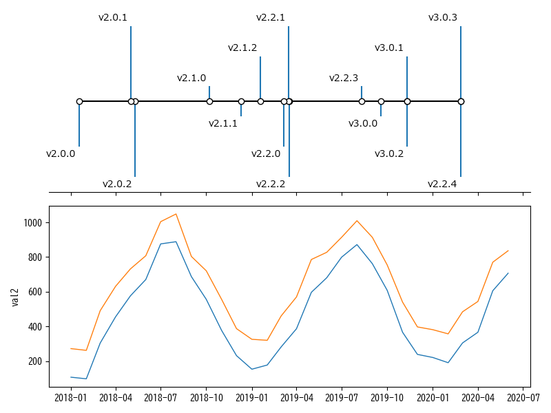
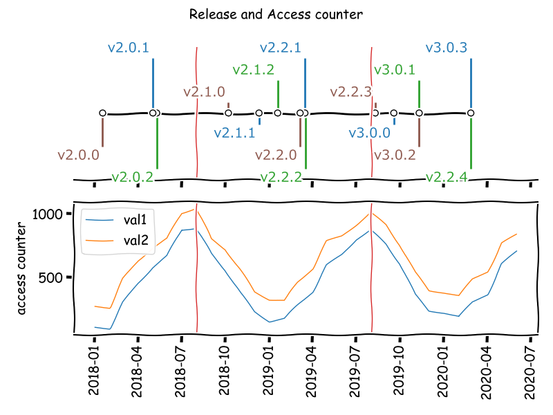

# python-sketches

```markdown
>  ____  _  _  _____  _   _   ___   _   _        ____  _  _  ____  _____   ___  _   _  ____  ____ 
> |  _ \( \/ )|_   _|| |_| | / _ \ | \ | | ____ /  __)| |/ )| ___)|_   _| / __)| |_| || ___)/  __)
> |  __/ \  /   | |  |  _  |( (_) )|  \| |(____)\__  \|   ( | __)   | |  ( (__ |  _  || __) \__  \
> |_|    (__)   |_|  |_| |_| \___/ |_| \_|      (____/|_|\_)|____)  |_|   \___)|_| |_||____)(____/
```

A set of [Python](https://www.python.org/) script that filter text-object input from the pipeline(stdin) and return text-object.

**Note**: This repository contains experimental Python scripts for prototyping and exploring new ideas. Although these scripts have been run by the author, they are not intended for production use and may be unstable or incomplete.

- For use in UTF-8 Japanese environments on windows.
- For my personal work and hobby use.
- Note that the code is spaghetti (due to my technical inexperience).
- Insufficient tests and error handlings.

script list:

```powershell
# One-liner to create function list for PowerShell
@(
    (cat README.md | sls '^#### \[[^[]+\]').Matches.Value.Replace('#### ','') `
    | sort {
        -join ( [int[]] ("$_".ToCharArray()) | % { [System.Convert]::ToString($_, 16)})
        } -Unique `
 ) -join ", " | Set-Clipboard
```

- [Calc-ChemMassPercent.py], [Calc-ChemWeightLR.py], [Calc-ChemWeightRL.py], [Calc-LPpulp.py], [Convert-Unit.py], [Get-Dataset.py], [Get-MolecularMass.py], [Get-PeriodicTable.py], [Get-YFinance], [Sanitize-FileName], [pycalc.py], [pymatcalc.py], [pyplot-pandas.py], [pyplot-timeline2.py], [pyplot-x-rs.py], [pyplot.py], [pysym.py]

A collection of filters primarily designed for pattern matching on irregular real-world text strings. It expects input in the form of UTF-8 encoded, space-delimited, line-oriented string data passed through a pipeline (text objects).

Each file under the `src` directory defines a single function. Most functions are self-contained and do not depend on others, allowing each file to be reused independently.  
(Some functions do have dependencies on others.)

This is a **mockup with minimal error handling**. It’s a set of command-line tools created by a non-technical office worker to efficiently, conveniently, and enjoyably handle daily text processing tasks.


## Install functions

1. Put `*.py` files under the `src` directory at any location.
2. Set terminal input/output encoding to `UTF-8`
    - The functions expect `UTF-8` encoded input, so if you want to run them on PowerShell in a Japanese environment, make sure the encoding is ready in advance.
    - if you use PowerShell, run the following dot sourcing command
        - `. path/to/python-sketches/operator.ps1`

Since the functions expect UTF-8 encoded input, it’s recommended to set the current process encoding to `UTF-8` before running them.

```powershell
# for PowerShell
# install favorite functions for japanese environment
# set encode
if ($IsWindows){
    chcp 65001
    [System.Console]::OutputEncoding = [System.Text.Encoding]::GetEncoding("utf-8")
    [System.Console]::InputEncoding  = [System.Text.Encoding]::GetEncoding("utf-8")
    # compartible with multi byte code
    $env:LESSCHARSET = "utf-8"
}
```

```powershell
# for PowerShell
# or sourcing dot files
. path/to/python-sketches/operator.ps1
```

## Description of each functions

The behavior, motivation, and a brief description of each function.

### Multipurpose

#### [pycalc.py] - Cli python-pandas executer

[pycalc.py]: src/pycalc.py

- Usage
    - man: `python pycalc.py -h`
    - `pycalc.py [-h] [-i INPUTFILE] [-d DELIMITER] [-m MODULE] [-v VARIABLE] [-n] [-q] [--index] [--datetime] [--nowrap] [--normalize] [--csv] [--tsv] [--ssv] [--max_rows MAX_ROWS] [--max_columns MAX_COLUMNS] [--max_colwidth MAX_COLWIDTH] [--size SIZE] [--debug] formula`
- Example
    - `python pycalc.py <formula;formula;...>`
    - `cat iris.csv | python pycalc.py -d "," "df.describe()"`
- Library
    - require: `argparse`, `numpy`, `pandas`

Standard input is read using `df = pd.read_csv(sys.stdin, sep=delimiter)`. Input from a file is also supported using the `-i <file>` option instead of a pipeline.

Multiple `<formula>` entries can be specified, separated by semicolons. If a formula contains an `=`, it will be executed using `exec(formula)`; if not, it will be evaluated as `ans = eval(formula)`.

However, if the `=` appears only inside parentheses, the formula is treated as an `eval`. For example, `df.describe(include='all')` is evaluated using `eval`.

Variables can be assigned using the `-v '<val1>=<str>;<val2>=<str>;...'` option.

Options:

```powershell
python pycalc.py -h
  -h, --help            show this help message and exit
  -i INPUTFILE, --inputfile INPUTFILE
                        input file name
  -d DELIMITER, --delimiter DELIMITER
                        line separator(delimiter)
  -m MODULE, --module MODULE
                        import modules
  -v VARIABLE, --variable VARIABLE
                        <variable>=<string>
  -n, --noheader        no header
  -q, --quiet           print as it is
  --index               col[0] as index
  --datetime            set df.columns[0] as datetime
  --nowrap              human readable for terminal
  --normalize           normalize data using unicodedata.normalize('NFKC')
  --csv                 output df as csv to stdout
  --tsv                 output df as tsv to stdout
  --ssv                 output df as ssv to stdout
  --max_rows MAX_ROWS   max rows
  --max_columns MAX_COLUMNS
                        max colmnss
  --max_colwidth MAX_COLWIDTH
                        max column width
  --size SIZE           graph size: w inch, h inch
  --debug               output dataframe
```

Examples:

```powershell
# describe
cat iris.ssv | python pycalc.py "df.dtypes"
cat iris.ssv | python pycalc.py "df.describe()"
cat iris.ssv | python pycalc.py "df.describe()" --nowrap
cat iris.ssv | python pycalc.py "df[df.columns[0:2]].describe()"
```

```powershell
# parse date examples
cat date.txt | python pycalc.py "df" --datetime
cat date.txt | python pycalc.py "df['date']=pd.to_datetime(df['date']);df['date2']=pd.to_datetime(df['date2']);df['diff']=df['date']-df['date2'];df.dropna()"
cat date.txt | python pycalc.py "df['date']=pd.to_datetime(df['date']).dt.strftime('%Y-%m-%d.%a');df"
cat date.txt | python pycalc.py "df['date']=pd.to_datetime(df['date']);df['timedelta_row']=df['date'].diff();df"
cat date.txt | python pycalc.py "df['date']=pd.to_datetime(df['date']);df['adddate']=df['date']+datetime.timedelta(days=31);df"
cat date.txt | python pycalc.py "df['date']=pd.to_datetime(df['date']);df['adddate']=df['date']-datetime.datetime.now();df"
cat date.txt | python pycalc.py "df['date']=pd.to_datetime(df['date']);df['add_date']=df['date']+pd.to_timedelta(df['val'], unit='d');df"
```

```powershell
# normalise using str.unicodedata.normalize('NKFC')
cat date.txt | python pycalc.py "df" --normalize
cat date.txt | python pycalc.py "df=df.applymap(lambda x: unicodedata.normalize('NFKC',x));df"
cat date.txt | python pycalc.py "df['ten']=df['ten'].str.normalize('NFKC');df"
cat date.txt | python pycalc.py "df['extract']=df['ten'].str.extract('(?P<city>新橋|日本橋)').dropna();df"
cat date.txt | python pycalc.py "df['address'] = df['address'].str.replace('〒[0-9]{3}\-[0-9]{4}', '')"
```

```powershell
# use apply
cat date.txt | python pycalc.py "df['len']=df['ten'].apply(len);df"
cat date.txt | python pycalc.py "df['len']=df['ten'].apply(lambda x: len(x));df"
```

```powershell
# output csv
cat iris.ssv |
    python pycalc.py -d " " "df.describe().to_csv()" |
    grep .

# fillna and output csv
cat iris.csv |
    python pycalc.py -d "," "df.fillna('NaN').to_csv()" |
    grep .
```

```powershell
# rename column name and print df
cat iris.csv | python pycalc.py -d "," "df.columns=['sl','sw','pl','pw','species']; df.head()"
cat iris.csv | python pycalc.py -d "," "df.columns=['sl','sw','pl','pw','species']; df.groupby('species').size()"
cat iris.csv | python pycalc.py -d "," "df.columns=['sl','sw','pl','pw','species']; df.groupby('species').mean()"
cat iris.csv | python pycalc.py -d "," "df.columns=['sl','sw','pl','pw','species']; a=df.groupby('species'); a.sum()"
cat iris.csv | python pycalc.py -d "," "df.columns=['sl','sw','pl','pw','species']; a=df.groupby('species'); a.std()"
cat iris.csv | python pycalc.py -d "," "df.columns=['sl','sw','pl','pw','species']; a=df.groupby('species'); a.var()"
```

```powershell
# groupby and aggregate
cat iris.csv | python pycalc.py -d "," "df.columns=['sl','sw','pl','pw','species']; df.groupby('species').agg('mean')"
cat iris.csv | python pycalc.py -d "," "df.columns=['sl','sw','pl','pw','species']; df.groupby('species').agg(lambda x: max(x) - min(x))"
cat iris.csv | python pycalc.py -d "," "df.columns=['sl','sw','pl','pw','species']; df.groupby('species').agg({'sl':'mean', 'sw':max, 'pl':np.min, 'pw':np.min})"
cat iris.csv | python pycalc.py -d "," "df.columns=['sl','sw','pl','pw','species']; df.groupby('species').describe()['sl']"
```

```powershell
# describe & include
cat iris.ssv | python pycalc.py "df.describe(include='all')"
cat iris.ssv | python pycalc.py "df.describe(include='object')"
cat iris.ssv | python pycalc.py "df.describe(include=[np.object, np.number])"

# describe & exclude
cat iris.ssv | python pycalc.py "df.describe(exclude=np.number)"
cat iris.ssv | python pycalc.py "df.describe(exclude=np.number).to_csv()" | grep .

# describe & percentiles
cat iris.ssv | 
    python pycalc.py "df.describe(percentiles=[0.1,0.2,0.5])"
    # 10%,20%,50%
```

```powershell
# Output summary statistics grouped by the "species" column
cat iris.csv | self $_ NF | python pycalc.py "df.groupby('species').describe()" --nowrap -d ","
```

```powershell
cat iris.csv | python pycalc.py "df[df.columns[:]].groupby('species').describe()" -d "," --nowrap
```

```powershell
# Using variables
echo 1 | python pycalc.py 's,t' -v 's=[i for i in range(6)];t=[i**2 for i in s]'
([0, 1, 2, 3, 4, 5], [0, 1, 4, 9, 16, 25])
```

```powershell
# Plotting with Matplotlib
## If "plot" or "plt" is found in the formula, matplotlib is automatically imported as plt
cat iris.csv | python pycalc.py -d "," "ax=df.groupby('species').max().plot.bar(rot=0);plt.show()"

# Multiple formulas can be specified using semicolons
echo 1 | python pycalc.py 'plt.plot(s,t);plt.show()' -v 's=[i for i in range(6)];t=[i**2 for i in s]'
[<matplotlib.lines.Line2D object at 0x7f96395f19a0>]
```

```powershell
# Creating a DataFrame
echo 1 | python pycalc.py "df=pd.DataFrame({'city': ['osaka', 'osaka', 'osaka', 'osaka', 'tokyo', 'tokyo', 'tokyo'],'food': ['apple', 'orange', 'banana', 'banana', 'apple', 'apple', 'banana'],'price': [100, 200, 250, 300, 150, 200, 400],'quantity': [1, 2, 3, 4, 5, 6, 7]});df"
echo 1 | python pycalc.py "df=...; df.groupby('city').mean()"
echo 1 | python pycalc.py "df=...; df.groupby('city').mean().T"
echo 1 | python pycalc.py "df=...; df.groupby('city').size()"
echo 1 | python pycalc.py "df=...; df.groupby('city').size()['osaka']"

echo 1 | python pycalc.py "df=...; df.groupby(['city','food']).mean()"
echo 1 | python pycalc.py "df=...; df.groupby(['city','food'],as_index=False).mean()"

echo 1 | python pycalc.py "df=...; df.groupby('city').agg(np.mean)"
echo 1 | python pycalc.py "df=...; df.groupby('city').agg({'price': np.mean, 'quantity': np.sum})"
```

```powershell
# Query examples
cat iris.csv | python pycalc.py -d "," "df.columns=['sl','sw','pl','pw','species'];df.query('sl < 5.0')"
cat iris.csv | python pycalc.py -d "," "df.columns=['sl','sw','pl','pw','species'];df.query('4.9 <= sl < 5.0')"
cat iris.csv | python pycalc.py -d "," "df.columns=['sl','sw','pl','pw','species'];df.query('sl > sw / 3')"
cat iris.csv | python pycalc.py -d "," "df.columns=['sl','sw','pl','pw','species'];df.query('species == \"setosa\"')"
cat iris.csv | python pycalc.py -d "," "df.columns=['sl','sw','pl','pw','species'];df.query('species in [\"setosa\"]')"

cat iris.csv | python pycalc.py -d "," "df.columns=['sl','sw','pl','pw','species'];df.query('index % 2 == 0')"

cat iris.csv | python pycalc.py -d "," "df.columns=['sl','sw','pl','pw','species'];df.query('sl > 5.0 & sw < 2.5')"
cat iris.csv | python pycalc.py -d "," "df.columns=['sl','sw','pl','pw','species'];df.query('sl > 5.0 and sw < 2.5')"
```

Solve simultaneous equations:

```powershell
echo 1 | python pycalc.py 'L=[[3/4,5/2], [-2,1]];R=[-6,-7];np.linalg.solve(L, R)'
[ 2. -3.]
```

### Statistics

#### [Get-Dataset.py] - A command-line tool to fetch datasets from the Seaborn library.

[Get-Dataset.py]: src/Get-Dataset.py

Fetch and display datasets from the **Seaborn** library.
If no arguments are given, it lists all available datasets.

- Usage
    - man: `python Get-Dataset.py --help`
    - `Get-Dataset.py [-h] [-l | --detail | -n DATASET_NAME] [-d CHAR]`
- Dependency
    - require: `argparse`, `seaborn`, `pandas`

OPTIONS:

```plaintext
  -h, --help            show this help message and exit
  -l, --list            List all available dataset names with details (default
                        action).
  --detail              List all available dataset names with details (default
                        action).
  -n DATASET_NAME, --name DATASET_NAME
                        Specify the name of the dataset to output as CSV.
  -d CHAR, --delimiter CHAR
                        Specify the delimiter for the CSV output. Default is a comma.
```

EXAMPLES:

```powershell
# List available datasets (simple, fast)
python Get-Dataset.py

# List available datasets (detail, slow)
python Get-Dataset.py --detail

# Output iris dataset as csv
python Get-Dataset.py -n iris
python Get-Dataset.py --name iris

# Output iris dataset with specified delimiter
python Get-Dataset.py -n iris -d ';'
```

### Mathematics

#### [pymatcalc.py] - Cli matrix calculator by connecting with pipes

[pymatcalc.py]: src/pymatcalc.py

- Usage
    - man: `python pymatcalc.py [-h]`
    - `pymatcalc.py [-h] [-i INPUTFILE] [-q] [-t DTYPE] [-d DELIMITER] [-V] formula`
- Inspired by
    - [Ryuichi Ueda and CIT Autonomous Robot Lab](https://b.ueda.tech/?post=00674)
        - [GitHub - ryuichiueda/PMAT: Pipe Oriented Matrix Calculator](https://github.com/ryuichiueda/PMAT)
    - Command: `matcalc`, `pmat`
- Dependency
    - require: `argparse`, `numpy`

If the input has multiple lines, it is treated as a matrix. if it has only one line, it is treated as a vector. By chaining multiple pipelines, you can reuse the results of previous operations.

Usage:

```powersell
pymatcalc '[<key>=]<formula>'

good: pymatcalc 'A@B'
good: pymatcalc 'C=A@B'

When using `=` in a formula, you must always specify a key (variable name).

good: pymatcalc 'C=np.eye(1, dtype=int)'
ng:   pymatcalc 'np.eye(1, dtype=int)'
```

Input format:

```
label val val ...
label val val ...
label val val ...
```

Functions:

```powershell
# Scalar product: pymatcalc 'C=A*B'
# Hadamard product (element-wise multiplication): pymatcalc 'C=np.multiply(A, B)'
# Identity matrix (method 1): pymatcalc 'C=np.eye(n, dtype=int)'
# Identity matrix (method 2): pymatcalc 'C=np.identity(n, dtype=int)'
# Transpose matrix: pymatcalc 'C=A.T'
# Determinant: pymatcalc 'C=np.linalg.det(A)*np.eye(1)'
# - When the result is a scalar, multiply by an identity matrix for consistent output shape
# Inverse matrix: pymatcalc 'np.linalg.inv(A)'
# Eigenvalues: pymatcalc 'np.linalg.eig(A)[0]'
# Eigenvectors: pymatcalc 'np.linalg.eig(A)[1]'
# Dot product (inner product): pymatcalc 'np.dot(A, B)'
# Matrix multiplication (method 1): pymatcalc 'A@B'
# Matrix multiplication (method 2): pymatcalc 'np.matmul(A, B)'
# Vector inner product: pymatcalc 'np.inner(A, B)'
# Vector outer product: pymatcalc 'np.outer(A, B)'
# Generate a random matrix: 'C=np.random.randint(-10,10,size=(3,3))'
# Solve a system of linear equations: pymatcalc 'C=np.linalg.inv(L)@R'
```

EXAMPLES:

```powershell
# input example:
$ cat matrix
A 1 1
A 2 4
B 4 3
B 2 1
```

```powershell
# calc example:
$ cat matrix | python pymatcalc.py 'A*B'
A 1 1
A 2 4
B 4 3
B 2 1
A*B 4.0 3.0
A*B 4.0 4.0

$ cat matrix | python pymatcalc.py 'A@B'
$ cat matrix | python pymatcalc.py 'np.matmul(A, B)'
A 1 1
A 2 4
B 4 3
B 2 1
A@B 6.0 4.0
A@B 16.0 10.0
```

```powershell
# np.eye(n), np.identity(n)
$ cat matrix | python pymatcalc.py'C=np.eye(3,dtype=int)'
$ cat matrix | python pymatcalc.py'C=np.identity(3,dtype=int)'
A 1 1
A 2 4
B 4 3
B 2 1
C 1 0 0
C 0 1 0
C 0 0 1
```

```powershell
# add new label to ans:
$ cat matrix | python pymatcalc.py 'C=A*B'
A 1 2
A 3 4
B 4 3
B 2 1
C 4.0 6.0
C 6.0 4.0
```

```powershell
# determinant:
#  To output value (not matrix), multiply np.eye(1)
$ cat matrix | python pymatcalc.py 'C=np.linalg.det(A)*np.eye(1)'
A 2 -6 4
A 7 2 3
A 8 5 -1
C -144.0
```

```powershell
# invert:
$ cat matrix | python pymatcalc.py 'C=np.linalg.inv(A)'
A -4 2
A 7 2
C -0.0909090909090909 0.09090909090909091
C 0.3181818181818182 0.1818181818181818

# test invert
$ cat matrix | python pymatcalc.py 'C=np.dot(A, np.linalg.inv(A))'
A -4 2
A 7 2
C 1.0 -5.551115123125783e-17
C 1.1102230246251565e-16 1.0
```

```powershell
# chain calc using pipe:
$ cat matrix | python pymatcalc.py 'C=A@B' | python pymatcalc.py 'D=A@C'
$ cat matrix | python pymatcalc.py 'C=A@(A@B)'
A 1 2
A 3 4
B 4 3
B 2 1
C 8.0 5.0
C 20.0 13.0
D 48.0 31.0
D 104.0 67.0
```

Solve simultaneous equations

```powershell
cat matrix
L 1 1
L 2 3
R 2
R 5
```

`Invert` Left and `@` Right

```
cat matrix | python pymatcalc.py 'ANS = np.linalg.inv(L) @ R'
L 1 1
L 2 4
R 9
R 22
ANS 7.0
ANS 2.0
```

or use `np.linalg.solve(Left, Right)`

```
cat matrix | python pymatcalc.py 'ANS = np.linalg.solve(L, R)'
L 1 1
L 2 4
R 9
R 22
ANS 7.0
ANS 2.0
```


#### [pysym.py] - sympy oneliner

[pysym.py]: src/pysym.py

[sympy](https://docs.sympy.org/latest/index.html) one-liner utility.

* **Usage**
  * Manual: `python pysym.py -h`
  * `pysym.py [-h] [-l] [-u] [-s] [--sympify] [--dot] [-m MODULE] [-v VARIABLE] [-i INPUTFILE] [--size SIZE] [--debug]`
* **Examples**
  * `pysym.py 'x**2 - 2*x - 15' [--latex|--simplify|--dot] [--sympify]`
  * `pysym.py 'sympy.factor(x**2 - 2*x - 15)'`
  * `pysym.py 'sympy.factor(x**2 - 2*x - 15).subs(x, 2)'`
    * The expression is parsed and evaluated by SymPy
    * `--latex`: convert the expression to LaTeX format
    * `--dot`: convert the expression to Graphviz dot language for visualization
    * `--sympify`: treat the expression as a raw string
      *Note: expressions containing `=` may not work properly with this option*
* **Options**
  * Use `-v '<val1>=<str>;<val2>=<str>;...'` to assign values to variables
- **Dependencies**
    - `sympy`, `argparse`, `numpy`, `matplotlib`
- **Notes**
    - Default settings
        - `sympy.init_printing(use_unicode=True)`
        - `x, y, z = sympy.symbols('x y z')`
        - `a, b, c = sympy.symbols('a b c')`
        - `import sympy`
        - `from sympy import symbols`
        - `from sympy import Eq, solve, diff, integrate, factorial, factor, summation`
        - `from sympy import sin, cos, tan, atan, log, I, pi, E, exp, sqrt`
        - `from sympy import Matrix, plot`
        - `from sympy.printing.dot import dotprint`
        - `import io, sys, os, re`
        - `import numpy as np`
        - `import math`
        - `import matplotlib.pyplot as plt`

Examples:

**Use as a calculator**

```powershell
# Using it as a calculator: 3
pysym.py '1+2'

# Using it as a calculator: 120.0
pysym.py '1.2e2'

# Using it as a calculator: 3628800
pysym.py 'sympy.factorial(10)'

# Polynomial expansion: x**2 - y**2
pysym.py "sympy.expand('(x+y)*(x-y)')"

# Executing Python commands: <class 'float'>
# Since eval is used internally, this kind of operation is possible
pysym.py 'type(1.2e2)'
```

**Expression evaluation, simplification, and LaTeX conversion**

```powershell
pysym.py 'x**2 + 2*x + 1'
# Display expression: x**2 + 2*x + 1

pysym.py 'x**2 + 2*x + 1' --latex (-l)
# Convert to LaTeX: x^{2} + 2 x + 1

pysym.py '(x**2 + 2*x + 1).subs(x,1)'
# Substitute a value: 4

pysym.py '(x**2 + 2*x + 1 + y**2).subs([(x,1),(y,2)])'
# Substitute multiple values using tuples: 8
```

**Simultaneous output of LaTeX expression and substitution result**

```powershell
pysym.py '(x**2 + 2*x + 1 + y**2).subs([(x,1),(y,2)])' --eq
\begin{align}
x^{2} + 2 x + y^{2} + 1 &= 8 \\
\end{align}
```

**Using the variable option `-v`**

```powershell
# You can add symbols via the -v option: X*Y + x**2 + 2*x + 1
pysym.py 'x**2 + 2*x + 1 + X*Y' -v "X,Y=sympy.symbols('X Y')"

# The -v option supports multiple definitions separated by semicolons: X*Y*Z + x**2 + 2*x + 1
pysym.py 'x**2 + 2*x + 1 + X*Y*Z' -v "X, Y=sympy.symbols('X Y');Z=sympy.symbols('Z')"

# Define a function in Python expression: x**2
pysym.py 'f(x)' -v 'def f(x): return x**2'

# Find the x-coordinates where y = x**2 - 1 and y = 4*x - 5 intersect or touch: [2]
pysym.py 'sympy.solve(sympy.Eq(f(x), g(x)), x)' -v 'def f(x): return x**2 - 1; def g(x): return 4*x - 5'
↓
# Since there is only one solution, they touch at a single point. What is the coordinate?
pysym.py '2,f(2)' -v 'def f(x): return x**2 - 1; def g(x): return 4*x - 5;'
# (2, 3)
↓
# Slope of the tangent line
pysym.py 'sympy.diff(f(x), x).subs(x, 2)' -v 'def f(x): return x**2 - 1; def g(x): return 4*x - 5;'
# 4

# Quadratic formula solution
pysym.py 'sympy.Eq(a*x**2+b*x+c, (-b + sympy.sqrt(-4*a*c + b**2))/(2*a))' --latex
# normal: Eq(a*x**2 + b*x + c, (-b + sqrt(-4*a*c + b**2))/(2*a))
# latex:  a x^{2} + b x + c = \frac{- b + \sqrt{- 4 a c + b^{2}}}{2 a}
```

**Various operations**

```powershell
# Solve simultaneous equations: {x: 3, y: 4}
pysym.py 'sympy.solve([3*x + 5*y -29, x + y - 7])'

# Calculate summation: 55
pysym.py 'sympy.summation(k, (k, 1, 10))' -v "k=sympy.symbols('k', integer=True)"

# Summation with symbolic upper limit: N*(N + 1)/2
pysym.py 'sympy.factor(sympy.summation(k, (k, 1, N)))' -v "k, N=sympy.symbols('k N', integer=True)"

# Define a function in Python expression: x**2
pysym.py 'f(x)' -v 'def f(x): return x**2'

# Factorization: (x + 1)**2
pysym.py 'sympy.factor(x**2 + 2*x + 1)'

# Differentiation: 2*x - 2
pysym.py 'sympy.diff(x**2 - 2*x - 15)'

# Indefinite integral: x**3/3 - x**2 - 15*x
pysym.py 'sympy.integrate(x**2 - 2*x - 15)'

# Definite integral: 250/3
pysym.py 'sympy.integrate(x**2 - 2*x - 15, (x, 0, 10))'

# Solve equations: {x: -3, y: 1}
pysym.py 'sympy.solve([x + 5*y - 2, -3*x + 6*y - 15], [x, y])'
```

**calc matrix**

* thanks: [How to use SymPy 10 – Matrix Definition and Operations - A Memo](https://atatat.hatenablog.com/entry/sympy10_matrix)

```powershell
# Define a matrix: Matrix([[a, b], [c, d]])
pysym.py 'sympy.Matrix([[a, b], [c, d]])' -v 'a,b,c=sympy.symbols("a b c"); d,e,f=sympy.symbols("d e f")'

# Define a column vector: Matrix([[x], [y]])
pysym.py 'sympy.Matrix([x, y])'

# Define a row vector: Matrix([[x, y]])
pysym.py 'sympy.Matrix([[x, y]])'

# Matrix multiplication result: Matrix([[a*x + b*y], [c*x + d*y]])
pysym.py 'A*B' -v 'd=sympy.symbols("d");A=sympy.Matrix([[a, b], [c, d]]);B=sympy.Matrix([x, y])'

# Matrix addition: Matrix([[4, 6], [8, 10]])
pysym.py 'A+B' -v 'A=sympy.Matrix([[1,2], [3,4]]);B=sympy.Matrix([[3, 4],[5,6]])'

# Get matrix dimensions: (2, 2)
pysym.py 'A.shape' -v 'd=sympy.symbols("d");A=sympy.Matrix([[a, b], [c, d]])'

# Get matrix row: Matrix([[a, b]])
pysym.py 'A.row(0)' -v 'd=sympy.symbols("d");A=sympy.Matrix([[a, b], [c, d]])'

# Get matrix column: Matrix([[b], [d]])
pysym.py 'A.col(1)' -v 'd=sympy.symbols("d");A=sympy.Matrix([[a, b], [c, d]])'

# Transpose matrix: Matrix([[a, c], [b, d]])
pysym.py 'A.transpose()' -v 'd=sympy.symbols("d");A=sympy.Matrix([[a, b], [c, d]])'

# Determinant: a*d - b*c
pysym.py 'A.det()' -v 'd=sympy.symbols("d");A=sympy.Matrix([[a, b], [c, d]])'

# Inverse matrix: Matrix([[d/(a*d - b*c), -b/(a*d - b*c)], [-c/(a*d - b*c), a/(a*d - b*c)]])
pysym.py 'A.inv()' -v 'd=sympy.symbols("d");A=sympy.Matrix([[a, b], [c, d]])'
pysym.py 'A**(-1)' -v 'd=sympy.symbols("d");A=sympy.Matrix([[a, b], [c, d]])'

# Eigenvalues: {a/2 + d/2 - sqrt(a**2 - 2*a*d + 4*b*c + d**2)/2: 1, a/2 + d/2 + sqrt(a**2 - 2*a*d + 4*b*c + d**2)/2: 1}
pysym.py 'A.eigenvals()' -v 'd=sympy.symbols("d");A=sympy.Matrix([[a, b], [c, d]])'

# Eigenvectors:
# [(a/2 + d/2 - sqrt(a**2 - 2*a*d + 4*b*c + d**2)/2, 1, [Matrix([
# [-d/c + (a/2 + d/2 - sqrt(a**2 - 2*a*d + 4*b*c + d**2)/2)/c],
# [                                                         1]])]), (a/2 + d/2 + sqrt(a**2 - 2*a*d + 4*b*c + d**2)/2, 1, [Matrix([
# [-d/c + (a/2 + d/2 + sqrt(a**2 - 2*a*d + 4*b*c + d**2)/2)/c],
# [                                                         1]])])]
pysym.py 'A.eigenvects()' -v 'd=sympy.symbols("d");A=sympy.Matrix([[a, b], [c, d]])'

# Reduced row echelon form:
# (Matrix([
# [1, 0, 3],
# [0, 1, 5]]), (0, 1))
pysym.py 'A.rref()' -v 'd=sympy.symbols("d");A=sympy.Matrix([[5, -2, 5], [1, 1, 8]])'
```

**Plotting with Matplotlib**

```powershell
# Sine curve
pysym.py "sympy.plot(sin(x), (x, -2*pi, 2*pi))"
pysym.py "sympy.plot(sin(x), (x, -2*pi, 2*pi), title='Title', xlabel='X-axis')"

# Example using matplotlib: plt.show()
pysym.py 'plt.plot(s,t);plt.show()' -v 's=[i for i in range(6)];t=[i**2 for i in s]'
[<matplotlib.lines.Line2D object at 0x7fe4c0a20670>]

# Specify graph size with --size width,height
pysym.py 'sympy.plot_parametric(cos(x), sin(x), (x, 0, 2*pi))' --size 5,5
```


#### [Calc-LPpulp.py] - Solve Linear Problem with matrix using PULP

[Calc-LPpulp.py]: src/Calc-LPpulp.py

Linear Problem optimizer that expresses objective variables and constraints in a matrix.

- Usage:
    - man: `python Calc-LPpulp.py [-h]`

input.txt:

```
0.013  0.008, "Total Cost of Ingredients per can"
1      1      == 100, "PercentagesSum"
0.100  0.200  >= 8.0, "ProteinRequirement"
0.080  0.100  >= 6.0, "FatRequirement"
0.001  0.005  <= 2.0, "FibreRequirement"
0.002  0.005  <= 0.4, "SaltRequirement"
```

script:

```powershell
python ./Calc-LPpulp.py --lbound 0 --category "Integer"
```

output:

```markdown
    Status  = Optimal (Minimize)
    Name    = objective
    Option  = {'lowBound': 0.0, 'upBound': None, 'cat': 'Integer'}
    x1      = 34.0
    x2      = 66.0
    Obj_Val = 0.97
```

input data format:

- basic
    - Express the objective function and constraints as a numeric matrix separated by spaces
    - The variable names are automatically assigned, but you can also specify any variable names (see below)
    - Multiple spaces will be replaced with a single space, so you can format it for easier reading

- skip line
    - The following lines of input data are skipped
        - Lines beginning with `#`
        - Empty lines
        - Space handling
            - Multiple consecutive spaces in input data are recognized as single space. (This is convenient when formatting input data to make it easier for human to read)
            - Extra spaces at the beginning and end of each line in the input data is removed.

- title line
    - The first line beginning with "#" is interpreted as title

- set variable symbols
    - Variables can be declared on the first line, excluding the title line, separated by spaces
    - If no variables are specified, `x1`, `x2`,... will be automatically assigned in order from the left column of the matrix
    - Variable names can also be specified with the `--names` option, but it is recommended to write variable names on the input data as much as possible. (This is because if you write the data and variable name separately, one is likely to be lost.)
    - If the number of variables is less than the number of columns in the objective function, the columns of the objective function to which variables are not assigned are simply considered as numbers to be summed. 

example: case where the number of variables is less than the number of columns of the objective function

```
x  y
1  1 1
3  5 0 <= 15
2  1   >= 4
1 -1 1 == 1
```

output:

```markdown
    1*x + 1*y + 1
    _C1: 3 x + 5 y <= 15
    _C2: 2 x + y >= 4
    _C3: x - y = 0
```

- set objective function
    - The first line starting with a number is considered the objective function
    - The specification of the objective function can be skipped. For example, it is not necessary to use an　objective function to derive a solution to a quadratic　function

example without objective function:

```
1 1 == 100
2 4 == 272
```

how to specify variable names when there is no objective function:

```
x y
1 1 == 100
2 4 == 272
```

- set constraints
    - Data lines containing operators `<=`, `==`, `>=` are considered constraints
    - Multiple constraints can be specified

- misc
    - If you specify the `-d` (`--debug`) option, it shows the description of the problem. It can be used to verify the answer
    - If you specify the `-o` (`--output <filepath>`), it output the python script into a file. It can be used when you want to add more complex processing

- what this script cannot do
    - Variable assignment statements cannot be written in input data
    - Variables cannot be automatically generated from a two-dimensional table

- References:
    - GitHub - coin-or/pulp: A python Linear Programming API
        - https://github.com/coin-or/pulp
    - Optimization with PuLP - PuLP documentation
        - https://coin-or.github.io/pulp/

Examples:

- Solve a Blending Problem
    - https://coin-or.github.io/pulp/CaseStudies/a_blending_problem.html

input.txt:

```
# title  --category "Integer" --lbound 0
## objective
0.013 0.008 0.010 0.002 0.005 0.001, "Total Cost of Ingredients per can"

## constraints
1 1 1 1 1 1 == 100
0.100 0.200 0.150 0.000 0.040 0.000 >= 8.0, "proteinPercent"
0.080 0.100 0.110 0.010 0.010 0.000 >= 6.0, "fatPercent"
0.001 0.005 0.003 0.100 0.150 0.000 <= 2.0, "fibrePercent"
0.002 0.005 0.007 0.002 0.008 0.000 <= 0.4, "saltPercent"
```

solve:

```powershell
python Calc-LPpulp.py -f input.txt --category "Integer" --lbound 0 [-d]
# or
cat input.txt | python Calc-LPpulp.py --category "Integer" --lbound 0 [-d]
```

```markdown
    Status  = Optimal (Minimize)
    Name    = title
    Option  = --cat "Integer" --lbound 0
    x1      = 0.0
    x2      = 60.0
    x3      = 0.0
    x4      = 0.0
    x5      = 0.0
    x6      = 40.0
    Obj_Val = 0.5
```

Simplest example:

```
0.013 0.008 0.010 0.002 0.005 0.001
1 1 1 1 1 1 == 100
0.100 0.200 0.150 0.000 0.040 0.000 >= 8.0
0.080 0.100 0.110 0.010 0.010 0.000 >= 6.0
0.001 0.005 0.003 0.100 0.150 0.000 <= 2.0
0.002 0.005 0.007 0.002 0.008 0.000 <= 0.4
```

solve:

```powershell
python Calc-LPpulp.py -f input.txt --lbound 0
```

```markdown
    Status  = Optimal (Minimize)
    Name    = Problem
    Option  = {'lowBound': 0.0, 'upBound': None, 'cat': 'Continuous'}
    x1      = 0.0
    x2      = 60.0
    x3      = 0.0
    x4      = 0.0
    x5      = 0.0
    x6      = 40.0
    Obj_Val = 0.52
```

Add title and comment

```
# this is title

## objective
0.013 0.008 0.010 0.002 0.005 0.001

## constraints
1 1 1 1 1 1 == 100
0.100 0.200 0.150 0.000 0.040 0.000 >= 8.0
0.080 0.100 0.110 0.010 0.010 0.000 >= 6.0
0.001 0.005 0.003 0.100 0.150 0.000 <= 2.0
0.002 0.005 0.007 0.002 0.008 0.000 <= 0.4
```

solve:

```powershell
python Calc-LPpulp.py -f input.txt --lbound 0
```

```markdown
    Status  = Optimal (Minimize)
    Name    = this_is_title
    Option  = {'lowBound': 0.0, 'upBound': None, 'cat': 'Continuous'}
    x1      = 0.0
    x2      = 60.0
    x3      = 0.0
    x4      = 0.0
    x5      = 0.0
    x6      = 40.0
    Obj_Val = 0.52
```

Add variable names within input data

```
# this is title

## objective
CHICKEN  BEEF MUTTON  RICE WHEAT   GEL
  0.013 0.008  0.010 0.002 0.005 0.001

## constraints
1 1 1 1 1 1 == 100
0.100 0.200 0.150 0.000 0.040 0.000 >= 8.0
0.080 0.100 0.110 0.010 0.010 0.000 >= 6.0
0.001 0.005 0.003 0.100 0.150 0.000 <= 2.0
0.002 0.005 0.007 0.002 0.008 0.000 <= 0.4
```

solve:

```powershell
python Calc-LPpulp.py -f input.txt --lbound 0 -c 'Integer'
```

```markdown
    Status  = Optimal (Minimize)
    Name    = this_is_title
    Option  = {'lowBound': 0.0, 'upBound': None, 'cat': 'Integer'}
    BEEF    = 60.0
    CHICKEN = 0.0
    GEL     = 40.0
    MUTTON  = 0.0
    RICE    = 0.0
    WHEAT   = 0.0
    Obj_Val = 0.5
```

output debug mode:

```powershell
python Calc-LPpulp.py -f input.txt --lbound 0 -c 'Integer' -d
```

output python script to file:

```powershell
python Calc-LPpulp.py -f input.txt --lbound 0 -c 'Integer' -o out.py
```

all input format:

```
# title  --category "Integer" --lbound 0

## objective
CHICKEN BEEF   MUTTON RICE  WHEAT GEL
0.013   0.008  0.010  0.002 0.005 0.001, "Total Cost of Ingredients per can"

## constraints
1 1 1 1 1 1 == 100
0.100 0.200 0.150 0.000 0.040 0.000 >= 8.0, "proteinPercent"
0.080 0.100 0.110 0.010 0.010 0.000 >= 6.0, "fatPercent"
0.001 0.005 0.003 0.100 0.150 0.000 <= 2.0, "fibrePercent"
0.002 0.005 0.007 0.002 0.008 0.000 <= 0.4, "saltPercent"
```


### Chemistry

#### [Get-PeriodicTable.py] - Get Element data using pymatgen

[Get-PeriodicTable.py]: src/Get-PeriodicTable.py

- Usage:
    - man: `python Get-PeriodicTable.py [-h]`
    - `Get-PeriodicTable.py [-f Element] [--raw] [--json] [-s] [-p] [-a] [-i ITEM] [-pad PADDING] [-h]`
    - `"Element" | Get-PeriodicTable.py [--raw] [--json] [-s] [-p] [-a] [-i ITEM] [-pad PADDING] [-h]`
    - Windows
        - `python Get-PeriodicTable.py -f "<Element>, <Element>, ..."`
        - `"<Element>, <Element>, ..." | python Get-PeriodicTable.py`
- Dependency:
    - pymatgen
        - https://pymatgen.org/
    - GitHub - materialsproject/pymatgen
        - https://github.com/materialsproject/pymatgen
        - https://pymatgen.org/pymatgen.core.html#module-pymatgen.core
- Install module:
    - https://github.com/materialsproject/pymatgen#installation
        - e.g. `python -m pip install pymatgen`
- Links:
    - Calc-ChemWeightRL.py, Calc-ChemWeightLR.py, Get-PeriodicTable.py, Get-MolecularMass.py

Options:

```markdown
    -h, --help            show this help message and exit
    -f FORMULA, --formula FORMULA
                          molecular formula
    --raw                 output json as-is
    --json                output json
    -s, --short           output short data
    -p, --pretty          output pretty data
    -a, --all             output all data
    -i ITEM, --item ITEM  select item
    -pad PADDING, --padding PADDING
                          display name padding
```

Example: get specified items (Case sensitive)

```powershell
python Get-PeriodicTable.py -f 'Cu,Ag,H' -i "Name, Atomic mass, Boiling point"
```

Output:

```yaml
Name              : Copper
Atomic mass       : 63.546
Boiling point     : 3200 K

Name              : Silver
Atomic mass       : 107.8682
Boiling point     : 2435 K

Name              : Hydrogen
Atomic mass       : 1.00794
Boiling point     : 20.28 K
```

Example: get short data

```powershell
"Fe" | python Get-PeriodicTable.py
```

Output:

```yaml
Atomic no         : 26
Name              : Iron
Atomic mass       : 55.845
Atomic radius     : 1.4
Boiling point     : 3134 K
Critical temperature : no data K
Density of solid  : 7874 kg m<sup>-3</sup>
ICSD oxidation states : [2, 3]
Ionization energies : [7.9024681, 16.19921, 30.651, 54.91, 75.0, 98.985, 124.976, 151.06, 233.6, 262.1, 290.9, 330.8, 361.0, 392.2, 456.2, 489.312, 1262.7, 1357.8, 1460.0, 1575.6, 1687.0, 1798.4, 1950.4, 2045.759, 8828.1879, 9277.6818]
IUPAC ordering    : 64
Liquid range      : 1323 K
Melting point     : 1811 K
Molar volume      : 7.09 cm<sup>3</sup>
Oxidation states  : [-2, -1, 1, 2, 3, 4, 5, 6]
Superconduction temperature : no data K
Thermal conductivity : 80 W m<sup>-1</sup> K<sup>-1</sup>
Van der waals radius : 2.04
Youngs modulus    : 211 GPa
```

Example: get pretty data

```powershell
"Fe" | python Get-PeriodicTable.py --pretty
```

Output:

```yaml
Atomic no         : 26
Name              : Iron
Atomic mass       : 55.845
Atomic radius     : 1.4
Boiling point     : 3134 K
Critical temperature : no data K
Density of solid  : 7874 kg m<sup>-3</sup>
ICSD oxidation states : [2, 3]
Ionization energies : [7.9024681, 16.19921, 30.651, 54.91, 75.0, 98.985, 124.976, 151.06, 233.6, 262.1, 290.9, 330.8, 361.0, 392.2, 456.2, 489.312, 1262.7, 1357.8, 1460.0, 1575.6, 1687.0, 1798.4, 1950.4, 2045.759, 8828.1879, 9277.6818]
IUPAC ordering    : 64
is_actinoid       : False
is_alkali_metal   : False
is_alkali_earth_metal : False
is_chalcogen      : False
is_halogen        : False
is_lanthanoid     : False
is_metal          : True
is_metalloid      : False
is_noble_gas      : False
is_post_transition_metal : False
is_quadrupolar    : False
is_rare_earth_metal : False
is_transition_metal : True
Liquid range      : 1323 K
Melting point     : 1811 K
Molar volume      : 7.09 cm<sup>3</sup>
Oxidation states  : [-2, -1, 1, 2, 3, 4, 5, 6]
Superconduction temperature : no data K
Thermal conductivity : 80 W m<sup>-1</sup> K<sup>-1</sup>
Van der waals radius : 2.04
Youngs modulus    : 211 GPa
reference         : https://pymatgen.org/pymatgen.core.html
search_bing       : https://www.bing.com/search?q=Iron
search_google     : https://www.google.com/search?q=Iron
search_wiki       : https://en.wikipedia.org/wiki/Iron
```

Example: output all data

```powershell
"Fe" | python Get-PeriodicTable.py --all
```

Example: Output as Json and convert to hashtable using PowerShell 7

```powershell
"Fe" | python Get-PeriodicTable.py --raw | ConvertFrom-Json -AsHashtable    
```
    

#### [Get-MolecularMass.py] - Get molecular data using pymatgen

[Get-MolecularMass.py]: src/Get-MolecularMass.py

- Usage:
    - man: `python Get-MolecularMass.py [-h]`
    - `Get-MolecularMass.py [-h] [-f FORMULA] [-p PROCESS] [-e END] [-b BEGIN] [-skip SKIP] [-r] [--replace REPLACE] [-s] [-pad PADDING] [-o]`
        - `'<composition>, <composition>, ...' | python Get-MolecularMass.py`
        - `python Get-MolecularMass.py -f '<composition>, <composition>, ...'`
- Dependency:
    - pymatgen
        - https://pymatgen.org/
    - GitHub - materialsproject/pymatgen
        - https://github.com/materialsproject/pymatgen
        - https://pymatgen.org/pymatgen.core.html#module-pymatgen.core
- Install module:
    - https://github.com/materialsproject/pymatgen#installation
        - e.g. `python -m pip install pymatgen`
- Links:
    - Calc-ChemWeightRL.py, Calc-ChemWeightLR.py, Get-PeriodicTable.py, Get-MolecularMass.py

Tips:

Each molecular weight is stored in the variables `M<int>`, `N<int>`.
`<int>` is assigned 1, 2, 3,... in the order of read molecules.

- `M<int>` is Molecular weight for each record.
- `N<int>` is Molecular name for each record.

Calculations using molecular weight can be performed using this variable with the following options:

```
--begin   "<exp;exp;...>"
--process "<exp;exp;...>"
--end     "<exp;exp;...>"
```

In the `--process` option, the `#` symbol is assigned 1,2,3,... in the order of molecules read.


Options:

```
-h, --help            show this help message and exit
-f FORMULA, --formula FORMULA
                      molecular formula
-p PROCESS, --process PROCESS
                      run expression for each material
-e END, --end END     run expression after output all materials
-b BEGIN, --begin BEGIN
                      run expression before read materials
-skip SKIP, --skip SKIP
                      skip applying expression to first record
-r, --remove_charges  remove charges from composition
--replace REPLACE     replace element using dictionary
-s, --short           short output
-pad PADDING, --padding PADDING
                      display name padding
-o, --only            output only expression
```

Examples: Using PowerShell on Windows:

```powershell
"LiFePO4, H4O2, CH2(SO4)2" | python Get-MolecularMass.py --short
```

Output:

```yaml
name              : LiFePO4
name_reduced_i    : LiFePO4, 1.0
chem_system       : Fe-Li-O-P
molar_mass        : 157.7574 (g/mol)
as_dict           : {'Li': 1.0, 'Fe': 1.0, 'P': 1.0, 'O': 4.0}
fractional_comp   : Li0.14285714 Fe0.14285714 P0.14285714 O0.57142857
set_variable      : M1 = 157.757362 (g/mol)

name              : H4O2
name_reduced_i    : H2O, 2.0
chem_system       : H-O
molar_mass        : 36.0306 (g/mol)
as_dict           : {'H': 4.0, 'O': 2.0}
fractional_comp   : H0.66666667 O0.33333333
set_variable      : M2 = 36.03056 (g/mol)

name              : CH2(SO4)2
name_reduced_i    : H2C(SO4)2, 1.0
chem_system       : C-H-O-S
molar_mass        : 206.1518 (g/mol)
as_dict           : {'C': 1.0, 'H': 2.0, 'S': 2.0, 'O': 8.0}
fractional_comp   : C0.07692308 H0.15384615 S0.15384615 O0.61538462
set_variable      : M3 = 206.15177999999997 (g/mol)
```

Example: Calculation example using molecular weight variables `M<int>`

```powershell
"LiFePO4, CH2(SO4)2" | python Get-MolecularMass.py -s --end 'print(M1 + M2)'
```

Output:

```yaml
name              : LiFePO4
name_reduced_i    : LiFePO4, 1.0
chem_system       : Fe-Li-O-P
molar_mass        : 157.7574 (g/mol)
as_dict           : {'Li': 1.0, 'Fe': 1.0, 'P': 1.0, 'O': 4.0}
fractional_comp   : Li0.14285714 Fe0.14285714 P0.14285714 O0.57142857
set_variable      : M1 = 157.757362 (g/mol)

name              : CH2(SO4)2
name_reduced_i    : H2C(SO4)2, 1.0
chem_system       : C-H-O-S
molar_mass        : 206.1518 (g/mol)
as_dict           : {'C': 1.0, 'H': 2.0, 'S': 2.0, 'O': 8.0}
fractional_comp   : C0.07692308 H0.15384615 S0.15384615 O0.61538462
set_variable      : M2 = 206.15177999999997 (g/mol)

exec_end          : print(M1 + M2)
return            : 363.909142
```

Example: Calculation example using molecular weight variables `M<int>`

In the `--process`, the `#` symbol is assigned 1,2,3,... in the order of molecules read.

```powershell
"LiFePO4, H4O2" | python Get-MolecularMass.py --short --process "C# = comp.weight;print(C#)" --end "print(C1 + C2)"
```

```yaml
name              : LiFePO4
name_reduced_i    : LiFePO4, 1.0
chem_system       : Fe-Li-O-P
molar_mass        : 157.7574 (g/mol)
as_dict           : {'Li': 1.0, 'Fe': 1.0, 'P': 1.0, 'O': 4.0}
fractional_comp   : Li0.14285714 Fe0.14285714 P0.14285714 O0.57142857
set_variable      : M1 = 157.757362 (g/mol)

exec_foreach      : C1 = comp.weight
return            :

exec_foreach      : print(C1)
return            : 157.757362 amu

name              : H4O2
name_reduced_i    : H2O, 2.0
chem_system       : H-O
molar_mass        : 36.0306 (g/mol)
as_dict           : {'H': 4.0, 'O': 2.0}
fractional_comp   : H0.66666667 O0.33333333
set_variable      : M2 = 36.03056 (g/mol)

exec_foreach      : C2 = comp.weight
return            :

exec_foreach      : print(C2)
return            : 36.03056 amu

exec_end          : print(C1 + C2)
return            : 193.787922 amu
```

Example: replace elements using dictionary

```powershell
"Fe2O3" | python Get-MolecularMass.py -s --replace '{"Fe":{"Mn":1.0}}'
```

Output:

```yaml
name              : Fe2O3
name_replaced     : Mn2O3, 1
name_reduced_i    : Mn2O3, 1.0
chem_system       : Mn-O
molar_mass        : 157.8743 (g/mol)
as_dict           : {'O': 3.0, 'Mn': 2.0}
fractional_comp   : O0.6 Mn0.4
set_variable      : M1 = 157.87429 (g/mol)
```

Example: replace Element Case 2

```powershell
"Fe2O3" | python Get-MolecularMass.py -s --replace '{"Fe":{"Mn":0.5,"Cu":0.5}}'
```

Output:

```yaml
name              : Fe2O3
name_replaced     : MnCuO3, 1
name_reduced_i    : MnCuO3, 1.0
chem_system       : Cu-Mn-O
molar_mass        : 166.4822 (g/mol)
as_dict           : {'O': 3.0, 'Mn': 1.0, 'Cu': 1.0}
fractional_comp   : O0.6 Mn0.2 Cu0.2
set_variable      : M1 = 166.482245 (g/mol)
```

Example: Calculation using `M<int>` and `N<int>` and --skip `<int>`

```powershell
"BaTiO3, BaCO3, TiO2" | python Get-MolecularMass.py --process 'print("{} : {:.3f} g".format(N#, 1/M1*M#*1.5))' -s -skip 1
```

Output:

```yaml
name              : BaTiO3
name_reduced_i    : BaTiO3, 1.0
chem_system       : Ba-O-Ti
molar_mass        : 233.1922 (g/mol)
as_dict           : {'Ba': 1.0, 'Ti': 1.0, 'O': 3.0}
fractional_comp   : Ba0.2 Ti0.2 O0.6
set_variable      : M1 = 233.19219999999999 (g/mol)

name              : BaCO3
name_reduced_i    : BaCO3, 1.0
chem_system       : Ba-C-O
molar_mass        : 197.3359 (g/mol)
as_dict           : {'Ba': 1.0, 'C': 1.0, 'O': 3.0}
fractional_comp   : Ba0.2 C0.2 O0.6
set_variable      : M2 = 197.33589999999998 (g/mol)

exec_foreach      : print("{} : {:.3f} g".format(N2, 1/M1*M2*1.5))
return            : BaCO3 : 1.269 g

name              : TiO2
name_reduced_i    : TiO2, 1.0
chem_system       : O-Ti
molar_mass        : 79.8658 (g/mol)
as_dict           : {'Ti': 1.0, 'O': 2.0}
fractional_comp   : Ti0.33333333 O0.66666667
set_variable      : M3 = 79.8658 (g/mol)

exec_foreach      : print("{} : {:.3f} g".format(N3, 1/M1*M3*1.5))
return            : TiO2 : 0.514 g
```


#### [Calc-ChemWeightRL.py] - Chemical weighing calculator using pymatgen

[Calc-ChemWeightRL.py]: src/Calc-ChemWeightRL.py

Calculate the weight(gram) of each term in the chemical formula from the first term on the Right side to the Left side. `(R -> L)`


- Usage:
    - man: `python Calc-ChemWeightRL.py [-h]`
    - `Calc-ChemWeightRL.py [-h] [-f FORMULA] [-g GRAM] [-p PADDING] [-wf WFORMAT] [-wp WPADDING] [-d] [-kg] [-mg] [-v]`
        - `'comp1 + comp2 -> product' | python Calc-ChemWeightRL.py`
        - `python Calc-ChemWeightRL.py -f 'comp1 + comp2 -> product'`
- Dependency:
    - pymatgen
        - https://pymatgen.org/
    - GitHub - materialsproject/pymatgen
        - https://github.com/materialsproject/pymatgen
        - https://pymatgen.org/pymatgen.core.html#module-pymatgen.core
- Install module:
    - https://github.com/materialsproject/pymatgen#installation
        - e.g. `python -m pip install pymatgen`
- Links:
    - Calc-ChemWeightRL.py, Calc-ChemWeightLR.py, Get-PeriodicTable.py, Get-MolecularMass.py
Notes:
    - Calculate by default to get 1g of the first term on the Right compound
    - Spaces in expressions are ignored
    - The number at the beginning of each compound is considered the number of moles

Options:

```
-h, --help            show this help message and exit
-f FORMULA, --formula FORMULA
                      molecular formula
-g GRAM, --gram GRAM  product weight
-p PADDING, --padding PADDING
                      debug padding
-wf WFORMAT, --wformat WFORMAT
                      weight format
-wp WPADDING, --wpadding WPADDING
                      weight padding
-d, --debug           debug
-kg, --kg             kilogram
-mg, --mg             milligram
-v, --verbose         verbose output
```

Example: Calculate Grams of Methane(`CH4`) and Oxygen(`O2`) required to obtain `44g` of carbon dioxide(`CO2`)

```powershell
"CH4 + 2 O2 -> CO2 + 2 H2O" | python Calc-ChemWeightRL.py -g 44.0
```

Output:

```yaml
Formula  :      CH4       +      2O2       ->      CO2       +      2H2O
Molratio :       1        :       2        :        1        :       2
Molmass  :     16.04      +   2 * 32.00    ->     44.01      +   2 * 18.02
Weight   :    16.039 g    +    63.984 g    ->    44.000 g    +    36.023 g
```

Example: verbose output (`-v`, `--verbose` option)

```powershell
"CH4 + 2 O2 -> CO2 + 2 H2O" | python Calc-ChemWeightRL.py -g 44.0 -v
```

Output:

```yaml
Type     : Product
Name     : CO2 * 1.0
Weight   : 44.00000000 (g)
Ratio    : 0.99978414 (ratio)
Mol_mass : CO2 = 44.0095 (g/mol)
Formula  : 1 / gram_per_mol / mol * target_gram = 1 / 44.010 / 1.0 * 44.000

Type     : Product
Name     : H2O * 2.0
Weight   : 36.02278235 (g)
Ratio    : 0.99978414 (ratio)
Mol_mass : H2O = 18.01528 (g/mol)
Formula  : gram_per_mol * mol * mol_ratio = 18.015 * 2.0 * 1.000

Type     : Material
Name     : CH4 * 1.0
Weight   : 16.03899703 (g)
Ratio    : 0.99978414 (ratio)
Mol_mass : CH4 = 16.04246 (g/mol)
Formula  : gram_per_mol * mol * mol_ratio = 16.042 * 1.0 * 1.000

Type     : Material
Name     : O2 * 2.0
Weight   : 63.98378532 (g)
Ratio    : 0.99978414 (ratio)
Mol_mass : O2 = 31.9988 (g/mol)
Formula  : gram_per_mol * mol * mol_ratio = 31.999 * 2.0 * 1.000
```


#### [Calc-ChemWeightLR.py] - Chemical weighing calculator using pymatgen

[Calc-ChemWeightLR.py]: src/Calc-ChemWeightLR.py

Calculate the weight(gram) of each term in the chemical formula from the first term on the Left side to the Right side. `(L -> R)`

- Usage:
    - man: `python Calc-ChemWeightLR.py [-h]`
    - `Calc-ChemWeightLR.py [-h] [-f FORMULA] [-g GRAM] [-p PADDING] [-wf WFORMAT] [-wp WPADDING] [-d] [-kg] [-mg] [-v]`
        - `'comp1 + comp2 -> product' | python Calc-ChemWeightLR.py`
        - `python Calc-ChemWeightLR.py -f 'comp1 + comp2 -> product'`
- Dependency:
    - pymatgen
        - https://pymatgen.org/
    - GitHub - materialsproject/pymatgen
        - https://github.com/materialsproject/pymatgen
        - https://pymatgen.org/pymatgen.core.html#module-pymatgen.core
- Install module:
    - https://github.com/materialsproject/pymatgen#installation
        - e.g. `python -m pip install pymatgen`
- Links:
    - Calc-ChemWeightRL.py, Calc-ChemWeightLR.py, Get-PeriodicTable.py, Get-MolecularMass.py
- Notes:
    - Calculate by default to get 1g of the first term on the Left compound
    - Spaces in expressions are ignored
    - The number at the beginning of each compound is considered the number of moles

Options:

```
-h, --help            show this help message and exit
-f FORMULA, --formula FORMULA
                      molecular formula
-g GRAM, --gram GRAM  product weight
-p PADDING, --padding PADDING
                      debug padding
-wf WFORMAT, --wformat WFORMAT
                      weight format
-wp WPADDING, --wpadding WPADDING
                      weight padding
-d, --debug           debug
-kg, --kg             kilogram
-mg, --mg             milligram
-v, --verbose         verbose output
```

Example: Calculate Grams of Carbon dioxide(`CO2`) from `16g` of Methane(`CH4`)

```powershell
"CH4 + 2 O2 -> CO2 + 2 H2O" | python Calc-ChemWeightLR.py -g 16.042
```

```
Formula  :      CH4       +      2O2       ->      CO2       +      2H2O
Molratio :       1        :       2        :        1        :       2
Molmass  :     16.04      +   2 * 32.00    ->     44.01      +   2 * 18.02
Weight   :    16.042 g    +    63.996 g    ->    44.008 g    +    36.030 g
```

Example: verbose output (`-v`, `--verbose` option)

```powershell
"CH4 + 2 O2 -> CO2 + 2 H2O" | python Calc-ChemWeightLR.py -g 16.042 -v
```

Output:

```yaml
Type     : Material
Name     : CH4 * 1.0
Weight   : 16.04200000 (g)
Ratio    : 0.99997133 (ratio)
Mol_mass : CH4 = 16.04246 (g/mol)
Formula  : 1 / gram_per_mol / mol * target_gram = 1 / 16.042 / 1.0 * 16.042

Type     : Material
Name     : O2 * 2.0
Weight   : 63.99576494 (g)
Ratio    : 0.99997133 (ratio)
Mol_mass : O2 = 31.9988 (g/mol)
Formula  : gram_per_mol * mol * mol_ratio = 31.999 * 2.0 * 1.000

Type     : Product
Name     : CO2 * 1.0
Weight   : 44.00823808 (g)
Ratio    : 0.99997133 (ratio)
Mol_mass : CO2 = 44.0095 (g/mol)
Formula  : gram_per_mol * mol * mol_ratio = 44.010 * 1.0 * 1.000

Type     : Product
Name     : H2O * 2.0
Weight   : 36.02952686 (g)
Ratio    : 0.99997133 (ratio)
Mol_mass : H2O = 18.01528 (g/mol)
Formula  : gram_per_mol * mol * mol_ratio = 18.015 * 2.0 * 1.000
```


#### [Calc-ChemMassPercent.py] - Calculate mass percent concentration when mixing multiple solutions

[Calc-ChemMassPercent.py]: src/Calc-ChemMassPercent.py

Recalculate the mass percent concentration

- Usage:
    - man: `python Calc-ChemMassPercent.py [-h]`
    - `Calc-ChemMassPercent.py [-h] [-f|--formula FORMULA] [-r|--round ROUND] [-m|--molar] [-mm|--massmolarity] [-e|--expression EXPRESSION] [-v] [--mvar] [-d|--debug]`
        - `echo 'solution.1 + solution.2 + ...' | python Calc-ChemMassPercent.py`
        - `python Calc-ChemMassPercent.py -f 'solution.1 + solution.2 + ...'`
- Thanks:
    - MathPython
        - <https://wiki3.jp/MathPython/page/34>
- Links:
    - [Calc-ChemMassPercent.py], [Calc-ChemWeightLR.py], [Get-PeriodicTable.py], [Get-MolecularMass.py], [Calc-ChemMassPercent.py]

Options:

```markdown
    -h, --help          show this help message and exit
    -f FORMULA, --formula FORMULA
                        molecular formula
    -m, --molar         calc molar concentration
    -r ROUND, --round ROUND
                        round
    -e EXPRESSION, --expression EXPRESSION
                        execute expression
    -v, --verbose       verbose output
    --mvar              Use M# in expression
    -d, --debug         debug
```

Input:

```powershell
python Calc-ChemMassPercent.py -f "100 mL : 0.3 NaCl, 0.03 T-N + 100 mL : 3.0% T-N +200 mL" -r 2
```

Output:

```yaml
Type          : Solution.1
Formula       : 100mL:0.3NaCl,0.03T-N
Volume        : 100 mL
NaCl          : 30.0 g / 100 mL = 0.30 (30.00 w/v%)
T-N           : 3.0 g / 100 mL = 0.03 (3.00 w/v%)

Type          : Solution.2
Formula       : 100mL:3.0%T-N
Volume        : 100 mL
T-N           : 3.0 g / 100 mL = 0.03 (3.00 w/v%)

Type          : Solution.3
Formula       : 200mL
Volume        : 200 mL

Type          : Product
Formula       : 100mL:0.3NaCl,0.03T-N + 100mL:3.0%T-N + 200mL
Total_Volume  : 400.0 mL
Total_NaCl    : 30.0 g / 400.0 mL = 0.07 (7.50 w/v%)
Total_T-N     : 6.0 g / 400.0 mL = 0.01 (1.50 w/v%)
Total_Solid   : 36.0 g / 400.0 mL = 0.09 (9.00 w/v%)
```


Expression pattern:

Basic:

```
Weight             -> 100
Weight : Percent % -> 100 : 3 %
Weight : Ratio     -> 100 : 0.03

<Rule>
- Allows specification of solute only
  (Example at the top of the list)
```

With Unit:

```
Volume [unit]                 -> 100 mL
Volume [unit] : w/v Percent % -> 100 mL : 3 %
Volume [unit] : Ratio         -> 100 mL : 0.03

Weight [unit]                 -> 100 kg
Weight [unit] : w/w Percent % -> 100 kg : 3 %
Weight [unit] : Ratio         -> 100 kg : 0.03

<Note>
- The Solute units must be the same throughout the formula.
  (If a unit difference detected, an error will be returned)
```

With Solvent name:

```
Volume : Percent % Name -> 100 : 3 % NaCl
Volume : Ratio Name     -> 100 : 0.03 NaCl
```

```
Mix Multiple Solutions with different concentrations (use the `+`):
-> 100:3% + 100:1%
-> 100mL:3%NaCl + 100mL:1%NaCl

<Note>
- Add up solvents with the same name.
- If the solvents name is omitted, the names
  `M1`, `M2`, ... are automatically assigned from the left.
```

Volume with density:

```
density=1.17 g/ml, Volume = 1000 ml, 35w/w% HCl

    -> 1.17 * 1000 g : 35% HCl
```

Mix Multiple Solutions with different concentrations (use the `+`):

```
-> 100:3% + 100:1%
-> 100mL:3%NaCl + 100mL:1%NaCl

<Note>
- Add up solvents with the same name.
- If the solvents name is omitted, the names
    M1, M2, ... are automatically assigned from the left.
```


Solutions containing multiple Solvents (use `,`):

```
-> 100 : 10%, 3%
-> 100 mL : 10% NaCl, 3% T-N

<Note>
- You can add as many Solvents as you want.
```

Solvent can be specified by solid content:

```
-> 100 mL + 0 mL : 15.0 NaCl (add 15g of NaCl)
-> 100 mL + 0 : 15.0 (add 15g of Something)

<Note>
In this case, if the total volume of aqueous solution
in the formula is zero, a "div/0" error will be returned.
```

Molarity mode (-m, --molar) syntax:

- Required: liquid volume unit, molecule name
- Optional: density

```
1. With volume unit and molecule name:
-> "1000 ml : 35% HCl" | python Calc-ChemMassPercent.py --molar

    Type          : Solution.1
    Formula       : 1000ml:35%HCl
    Volume        : 1000 ml
    HCl           : 350.0 g / 36.461 amu / 1.0 L = 9.599 mol/L (M)

2. With density (density * volume):
-> "1.17 * 1000 g: 35% HCl" | python Calc-ChemMassPercent.py --molar

    Type          : Solution.1
    Formula       : 1.17*1000g:35%HCl
    Volume        : 1170.0 g (1.000 L)
    HCl           : 409.5 g / 36.461 amu / 1.0 L = 11.231 mol/L (M)

<Note>
- If the solvent unit is liquid volume rather than mass, 
    the concentration of the solvent will be w/v% instead of w/w%.
    - 1st examples unit: solution = "ml", solvent = "w/v %"
    - 2nd examples unit: solution = "g",  solvent = "w/w %"
- By specifying the density, the molarity (mol/L) can be calculated.
- Density must be written to the left of the liquid volume.
- When specifying density, the liquid volume unit is mass.
```


Practices:

```markdown
## <Q.1>

Dilute 100mL of 3w/v% NaCl solution
to double volume with water.

    100 mL : 3% NaCl + 100 mL
    100 mL : 0.03 NaCl + 100 mL
    100 : 3% + 100
    100 : 0.03 + 100
```

```markdown
## <Q.2>

An aqueous solution weighing 100g containing
10w/w% NaCl and 3w/w%T-N as a solvent.

    100 g : 10% NaCl, 3% T-N
    100 g : 0.1 NaCl, 0.03 T-N
    100 : 10%, 3%
    100 : 0.1, 0.03
```

`/`,`*` can be used for concentration term, but do not use `+` because it is used to express mixtures of Solutions:

```
100 : 10%, 3% = 100 : 10/100, 3/100*1.0
```

```markdown
## <Q.3>

Calculate the molar concentration (mol/L)
of CH3COOH
with a density of 1.05 g/mL at 20℃
and a purity of 100 w/w%.
```

```powershell
"1.05 * 1000 g : 100% CH3COOH" | python Calc-ChemMassPercent.py --molar
```

```yaml
Type          : Solution.1
Formula       : 1.05*1000g:100%CH3COOH
Weight        : 1050.0 g (1.000 L)
CH3COOH       : 1050.0 g / 60.052 amu / 1.0 L = 17.485 mol/L (M)

Type          : Product
Formula       : 1.05*1000g:100%CH3COOH
Total_Weight  : 1050.0 g (1.000 L)
Total_CH3COOH : 1050.0 g / 60.052 amu / 1.0 L = 17.485 mol/L (M)
```


```markdown
## <Q.4>

Calculate the factor(molar concentration ratio) of HCl/N,
1000 ml : 4.21 w/v% of N and 12.34 w/v% of HCl
```

```powershell
"1000ml: 4.21% N, 12.34% HCl" `
    | python Calc-ChemMassPercent.py `
        --molar `
        --expression 'print("Total_Volume = {} {}".format(Prod.volume, Prod.unit));print( "factor = {:.4f} HCl/N molar concentration ratio".format(HCl.molar / N.molar))' `
        --verbose
```

```yaml
Type          : Solution.1
Formula       : 1000ml:4.21%N,12.34%HCl
Volume        : 1000 ml
N             : 42.1 g / 14.007 amu / 1.0 L = 3.006 mol/L (M)
HCl           : 123.39999999999999 g / 36.461 amu / 1.0 L = 3.384 mol/L (M)

Type          : Product
Formula       : 1000ml:4.21%N,12.34%HCl
Total_Volume  : 1000.0 ml
Total_N       : 42.1 g / 14.007 amu / 1.0 L = 3.006 mol/L (M)
Total_HCl     : 123.39999999999999 g / 36.461 amu / 1.0 L = 3.384 mol/L (M)

Set_Variable  : Prod = Product(name, volume, unit)
Set_Variable  : N = Material(name, volume, unit, mol, molar, molar_unit)
Set_Variable  : HCl = Material(name, volume, unit, mol, molar, molar_unit)

exec_end      : print("Total_Volume = {} {}".format(Prod.volume, Prod.unit))
return        : Total_Volume = 1000.0 ml

exec_end      : print( "factor = {:.4f} HCl/N molar concentration ratio".format(HCl.molar / N.molar))
return        : factor = 1.1260 HCl/N molar concentration ratio
```

```markdown
## <Q.5>

Calculate mass molarity of
d=1.2 g/ml, 1000 ml, 20 w/w% NaOH
```

```powershell
echo "1.2*1000 g : 20% NaOH" | python Calc-ChemMassPercent.py -mm
# or
echo "1.2*1000 g : 20% NaOH" | python Calc-ChemMassPercent.py --massmolarity
```

```yaml
Type          : Solution.1
Formula       : 1.2*1000g:20%NaOH
Weight        : 1200.0 g (1.000 L)
NaOH          : 240.0 g / 39.997 amu / 0.96 kg = 6.250 mol/kg

Type          : Product
Formula       : 1.2*1000g:20%NaOH
Total_Weight  : 1200.0 g (1.000 L)
Total_NaOH    : 240.0 g / 39.997 amu / 0.96 kg = 6.250 mol/kg
```


EXAMPLES:

Dilute a solvent with a weight of 100 in which 15 w/w% of something (M1) is dissolved with the same weight of water.

```powershell
python Calc-ChemMassPercent.py -f "100:0.15+100"
```

```yaml
Type          : Solution.1
Formula       : 100:0.15
Weight        : 100
M1            : 15.0 / 100 = 0.150 (15.000 %)

Type          : Solution.2
Formula       : 100
Weight        : 100

Type          : Product
Formula       : 100:0.15 + 100
Total_Weight  : 200.0
Total_M1      : 15.0 / 200.0 = 0.075 (7.500 %)
Total_Solid   : 15.0 / 200.0 = 0.075 (7.500 %)
```

Dissolve 15.0g of salt in 100g of saline solution with a concentration of 10 w/w%

```powershell
python Calc-ChemMassPercent.py -f "100 g : 10% NaCl + 0 g : 15.0 NaCl"
```

```yaml
Type          : Solution.1
Formula       : 100g:0.1NaCl
Weight        : 100 g
NaCl          : 10.0 g / 100 g = 0.100 (10.000 w/w%)

Type          : Solution.2
Formula       : 0g:15.0NaCl
Weight        : 0 g
NaCl          : 15.0 g

Type          : Product
Formula       : 100g:0.1NaCl + 0g:15.0NaCl
Total_Weight  : 100.0 g
Total_NaCl    : 25.0 g / 100.0 g = 0.250 (25.000 w/w%)
Total_Solid   : 25.0 g / 100.0 g = 0.250 (25.000 w/w%)
```

Calculate mass percent concentration when mixing multiple solutions.

```powershell
"100 L : 3.0% NaCl + 100 L : 9.0% NaCl + 200" | python Calc-ChemMassPercent.py
# or
python Calc-ChemMassPercent.py -f "100 L : 3.0% NaCl + 100 L : 9.0% NaCl + 200"
```

```yaml
Type          : Solution.1
Formula       : 100L:3.0%NaCl
Volume        : 100 L
NaCl          : 3.0 kg / 100 L = 0.030 (3.000 w/v%)

Type          : Solution.2
Formula       : 100L:9.0%NaCl
Volume        : 100 L
NaCl          : 9.0 kg / 100 L = 0.090 (9.000 w/v%)

Type          : Solution.3
Formula       : 200
Volume        : 200

Type          : Product
Formula       : 100L:3.0%NaCl + 100L:9.0%NaCl + 200
Total_Volume  : 400.0 L
Total_NaCl    : 12.0 kg / 400.0 L = 0.030 (3.000 w/v%)
Total_Solid   : 12.0 kg / 400.0 L = 0.030 (3.000 w/v%)
```

`-v`,` --verbose` option: Output total solvent weight for each step

```powershell
python Calc-ChemMassPercent.py -f "100 L : 3.0% NaCl + 100 L : 9.0% NaCl + 200" -v
```

```yaml
Type          : Solution.1
Formula       : 100L:3.0%NaCl
Volume        : 100 L
NaCl          : 3.0 kg / 100 L = 0.030 (3.000 w/v%)
Total_Volume  : 100.0 L
Total_Solid   : 3.0 kg / 100.0 L = 0.030 (3.000 w/v%)
Total_NaCl    : 3.0 kg / 100.0 L = 0.030 (3.000 w/v%)

Type          : Solution.2
Formula       : 100L:9.0%NaCl
Volume        : 100 L
NaCl          : 9.0 kg / 100 L = 0.090 (9.000 w/v%)
Total_Volume  : 200.0 L
Total_Solid   : 12.0 kg / 200.0 L = 0.060 (6.000 w/v%)
Total_NaCl    : 12.0 kg / 200.0 L = 0.060 (6.000 w/v%)

Type          : Solution.3
Formula       : 200
Volume        : 200
Total_Volume  : 400.0 L
Total_Solid   : 12.0 kg / 400.0 L = 0.030 (3.000 w/v%)
Total_NaCl    : 12.0 kg / 400.0 L = 0.030 (3.000 w/v%)

Type          : Product
Formula       : 100L:3.0%NaCl + 100L:9.0%NaCl + 200
Total_Volume  : 400.0 L
Total_NaCl    : 12.0 kg / 400.0 L = 0.030 (3.000 w/v%)
Total_Solid   : 12.0 kg / 400.0 L = 0.030 (3.000 w/v%)
```

Simple expression: Mix 100g of 3w/w% saline and 100g of 9w/w% saline:

```powershell
python Calc-ChemMassPercent.py -f "100g:3% + 100g:9%"
```

```yaml
Type          : Solution.1
Formula       : 100g:3%
Weight        : 100 g
M1            : 3.0 g / 100 g = 0.030 (3.000 w/w%)

Type          : Solution.2
Formula       : 100g:9%
Weight        : 100 g
M1            : 9.0 g / 100 g = 0.090 (9.000 w/w%)

Type          : Product
Formula       : 100g:3% + 100g:9%
Total_Weight  : 200.0 g
Total_M1      : 12.0 g / 200.0 g = 0.060 (6.000 w/w%)
Total_Solid   : 12.0 g / 200.0 g = 0.060 (6.000 w/w%)
```

Mixing multiple solutions containing multiple solvents

```powershell
python Calc-ChemMassPercent.py -f "100 mL : 0.3 NaCl, 0.03 T-N + 100 mL : 3.0% T-N +200 mL" -r 2
```

```yaml
Type          : Solution.1
Formula       : 100mL:0.3NaCl,0.03T-N
Volume        : 100 mL
NaCl          : 30.0 g / 100 mL = 0.30 (30.00 w/v%)
T-N           : 3.0 g / 100 mL = 0.03 (3.00 w/v%)

Type          : Solution.2
Formula       : 100mL:3.0%T-N
Volume        : 100 mL
T-N           : 3.0 g / 100 mL = 0.03 (3.00 w/v%)

Type          : Solution.3
Formula       : 200mL
Volume        : 200 mL

Type          : Product
Formula       : 100mL:0.3NaCl,0.03T-N + 100mL:3.0%T-N + 200mL
Total_Volume  : 400.0 mL
Total_NaCl    : 30.0 g / 400.0 mL = 0.07 (7.50 w/v%)
Total_T-N     : 6.0 g / 400.0 mL = 0.01 (1.50 w/v%)
Total_Solid   : 36.0 g / 400.0 mL = 0.09 (9.00 w/v%)
```

### Physics

#### [Convert-Unit.py] - Convert physical units using sympy.physics.units

[Convert-Unit.py]: src/Convert-Unit.py

usage:

```powershell
python Convert-Unit.py [-h] [-n] value from_unit to_unit
```

positional arguments:

```markdown
value          Numeric value to convert
from_unit      Unit to convert from (e.g. 'km')
to_unit        Unit to convert to (e.g. 'm')
```

options:

```markdown
-h, --help     show this help message and exit
-n, --numeric  Evaluate the result numerically
```

Examples:

```poweshell
python Convert-Unit.py 100 cm m       # Convert 100 centimeters to meters
python Convert-Unit.py 5 cal J -n     # Convert 5 calories to joules (numerically)
python Convert-Unit.py 10 F C         # Convert 10°F to Celsius
python Convert-Unit.py 3 BTU kJ       # Convert 3 BTU to kilojoules
python Convert-Unit.py 36 km/h m/s
python Convert-Unit.py 500 lm W       # Convert 500 lumens to watts (if applicable)
```


### Graph and chart

#### [pyplot.py] - Plot chart using matplotlib

[pyplot.py]: src/pyplot.py

棒グラフなどのチャートをプロットする。入力はパイプライン経由の半角スペース区切り「ヘッダあり」データを期待する。Wrapper of `matplotlib`. 

- Usage
    - man: `python pyplot.py [-h|--help]`
    - `python pyplot.py [-h] [-d DELIMITER] [-o OUTPUT] [-i INPUTFILE] [--dpi DPI] [--x X] [--y Y] [--size SIZE] [--layout LAYOUT]`
- Examples
    - `cat iris.csv | python pyplot.py -d ","`
    - `cat iris.csv | python pyplot.py -d "," --index`
    - `cat date.csv | python pyplot.py -d "," --datetime --minterval 2 --rot 90 --dformat "%Y-%m`n(%a)"`
    - `cat iris.csv | python pyplot.py -d "," --sorta 1,2`
    - `cat iris.csv | python pyplot.py -d "," --pair --hue 5`
    - `cat iris.csv | python pyplot.py -d "," --pair --hue 5 --seaborn`
    - `cat iris.csv | python pyplot.py -d "," --scatter --x 1 --y 3`
    - `cat iris.csv | python pyplot.py -d "," --scatter --x 1 --y 3 --hue 5`
    - `cat iris.csv | python pyplot.py -d "," --scatter --x 1 --y 3 --lm`
- Dependency
    - require: `argparse`, `numpy`, `pandas`, `matplotlib.dates`


Usage:

```powershell
python pyplot.py --help

usage: pyplot.py [-h] [-d DELIMITER] [-o OUTPUT] [-i INPUTFILE] [--dpi DPI] [--x X] [--y Y] [--size SIZE] [--layout LAYOUT]
    [--fontsize FONTSIZE] [--fontsizet FONTSIZET] [--anzu] [--natsume] [--natsumeo] [--nofont] [--self SELF] [--delf DELF]
    [--sorta SORTA] [--sortd SORTD] [--noheader] [--notskipobject] [--index] [--datetime] [--dformat DFORMAT]
    [--yinterval YINTERVAL] [--minterval MINTERVAL] [--dinterval DINTERVAL] [--winterval WINTERVAL]
    [--datetimelocate {year,month,day,hour,minute,auto,monday,tuesday,wednesday,thursday,friday,saturday,sunday}]
    [--datetimeinterval DATETIMEINTERVAL] [--mtype MTYPE] [--scatter] [--line] [--step] [--bar] [--barh] [--hist] [--box]
    [--kde] [--area] [--pie] [--hexbin] [--joint] [--pair]
    [--style {bmh,classic,dark_background,fast,fivethirtyeight,ggplot,grayscale,seaborn-bright,seaborn-colorblind,seaborn-dark-palette,seaborn-dark,seaborn-darkgrid,seaborn-deep,seaborn-muted,seaborn-notebook,seaborn-paper,seaborn-pastel,seaborn-poster,seaborn-talk,seaborn-ticks,seaborn-white,seaborn-whitegrid,seaborn,Solarize_Light2,tableau-colorblind10,_classic_test}]
    [--lm] [--hue HUE] [--offlegend]
    [--legendloc {best,upper right,upper left,lower left,lower right,right,center left,center right,lower center,upper center,center}]
    [--legendloc2 LEGENDLOC2] [--adjust ADJUST] [--title TITLE] [--offtitle] [--spines {zero,center}] [--reverse]
    [--xlab XLAB] [--ylab YLAB] [--xlim XLIM] [--ylim YLIM] [--ymin YMIN] [--ymax YMAX] [--grid] [--gridx] [--gridy]
    [--logx] [--logy] [--logxy] [--rot ROT] [--linewidth LINEWIDTH] [--hline HLINE] [--hlinewidth HLINEWIDTH]
    [--hlinecolor HLINECOLOR] [--hline0] [--vline VLINE] [--vlinecolor VLINECOLOR] [--vlinewidth VLINEWIDTH]
    [--hspan HSPAN] [--hspancolor HSPANCOLOR] [--hspanalpha HSPANALPHA] [--vspan VSPAN] [--vspancolor VSPANCOLOR]
    [--vspanalpha VSPANALPHA] [--today] [--now] [--seaborn] [--monochrome] [--mycolormap] [--debug] [--y2] [--y2lim Y2LIM]
    [--logy2] [--y2lab Y2LAB] [--y2color Y2COLOR] [--grep GREP] [--gcolor GCOLOR] [--gcolor2 GCOLOR2] [--xrs XRS] [--xkcd]
```

Examples:

```powershell
# 区切りは -d "<separator>"で変更可能。
# デフォルトで半角スペース区切り入力を期待
cat iris.csv | python pyplot.py -d ","
```

```powershell
# --indexで、1列目をpandas dataframeのindexとみなす
cat iris.csv | python pyplot.py -d "," --index
```

```powershell
# --datetimeで、1列目をpandas dataframeのdatetime型indexとみなす
cat date.csv | python pyplot.py -d "," --datetime --minterval 2 --rot 90 --dformat "%Y-%m`n(%a)"
```

```powershell
# --pairでペアプロット（行列散布図）を描画
cat iris.csv | python pyplot.py -d "," --pair --hue 5
cat iris.csv | python pyplot.py -d "," --pair --hue 5 --seaborn
```

```powershell
# --scatterで散布図を描画。デフォルトで1,2列目を使用
cat iris.csv | python pyplot.py -d "," --scatter
cat iris.csv | python pyplot.py -d "," --scatter --x 1 --y 3
# --hue <column-number>で任意列を用いて層別に色分け
cat iris.csv | python pyplot.py -d "," --scatter --x 1 --y 3 --hue 5
```

```powershell
# 散布図に最小二乗法を適用し回帰直線をプロット。同時に線形回帰式及びR^2値を凡例に表示
cat iris.csv | python pyplot.py -d "," --scatter --x 1 --y 3 --lm
```

Options:

```powershell
python pyplot.py --help

options:
  -h, --help            show this help message and exit
  -d DELIMITER, --delimiter DELIMITER
                        line separator(delimiter)
  -o OUTPUT, --output OUTPUT
                        output file name
  -i INPUTFILE, --inputfile INPUTFILE
                        input file name
  --dpi DPI             output dpi
  --x X                 x columns in scatter plot
  --y Y                 y columns in scatter plot
  --size SIZE           w inch, h inch
  --layout LAYOUT       subplot layout
  --fontsize FONTSIZE   fontsize
  --fontsizet FONTSIZET
                        title fontsize
  --anzu                font: anzu
  --natsume             font: natsume
  --natsumeo            font: natsume osae
  --nofont              do not set font
  --self SELF           select fields
  --delf DELF           delete fields
  --sorta SORTA         sort by ascending
  --sortd SORTD         sort by descending
  --noheader            noheader data
  --notskipobject       do not skip object dtype
  --index               set df.columns[0] as index
  --datetime            set df.columns[0] as datetime
  --dformat DFORMAT     xaxis datetime formatter
  --yinterval YINTERVAL
                        year interval
  --minterval MINTERVAL
                        month interval
  --dinterval DINTERVAL
                        day interval
  --winterval WINTERVAL
                        weekday interval
  --datetimelocate {year,month,day,hour,minute,auto,monday,tuesday,wednesday,thursday,friday,saturday,sunday}
                        xaxis datetime locater
  --datetimeinterval DATETIMEINTERVAL
                        xaxis date interval
  --mtype MTYPE         marker type
  --scatter             graph type: scatter
  --line                graph type: line
  --step                graph type: line + step
  --bar                 graph type: bar plot
  --barh                graph type: bar plot
  --hist                graph type: histogram
  --box                 graph type: box plot
  --kde                 graph type: Kernel density estimation
  --area                graph type: area
  --pie                 graph type: pie chart
  --hexbin              graph type: hexbin
  --joint               graph type: Plotting joint and marginal distributions
  --pair                graph type: pair plot
  --style {bmh,classic,dark_background,fast,fivethirtyeight,ggplot,grayscale,seaborn-bright,seaborn-colorblind,seaborn-dark-palette,seaborn-dark,seaborn-darkgrid,seaborn-deep,seaborn-muted,seaborn-notebook,seaborn-paper,seaborn-pastel,seaborn-poster,seaborn-talk,seaborn-ticks,seaborn-white,seaborn-whitegrid,seaborn,Solarize_Light2,tableau-colorblind10,_classic_test}
                        graph style
  --lm                  set least square methods line in scatter plot
  --hue HUE             hue label columns
  --offlegend           legend switch
  --legendloc {best,upper right,upper left,lower left,lower right,right,center left,center right,lower center,upper center,center}
                        legend location
  --legendloc2 LEGENDLOC2
                        legend location
  --adjust ADJUST       space adjust. eg: 0.1,0.8
  --title TITLE         title
  --offtitle            disable scatter plot title
  --spines {zero,center}
                        set spines(ticks location)
  --reverse             reverse y axis
  --xlab XLAB           x axis label
  --ylab YLAB           y axis label
  --xlim XLIM           x axis limit
  --ylim YLIM           y axis limit
  --ymin YMIN           y axis min
  --ymax YMAX           y axis max
  --grid                grid
  --gridx               grid x-axis
  --gridy               grid y-axis
  --logx                logx
  --logy                logy
  --logxy               logxy
  --rot ROT             xlab rotate
  --linewidth LINEWIDTH
                        line width
  --hline HLINE         horizon lines
  --hlinewidth HLINEWIDTH
                        horizon line width
  --hlinecolor HLINECOLOR
                        horizon line colors
  --hline0              add y zero line
  --vline VLINE         vertical lines
  --vlinecolor VLINECOLOR
                        vertical line colors
  --vlinewidth VLINEWIDTH
                        vorizon line width
  --hspan HSPAN         fill h-range
  --hspancolor HSPANCOLOR
                        fillcolor h-range
  --hspanalpha HSPANALPHA
                        fillcolor alpha h-range
  --vspan VSPAN         fill v-range
  --vspancolor VSPANCOLOR
                        fillcolor v-range
  --vspanalpha VSPANALPHA
                        fillcolor alpha v-range
  --today               add today vline
  --now                 add now datetime vline
  --seaborn             pair plot
  --monochrome          monochrome line
  --mycolormap          my color map
  --debug               output dataframe
  --y2                  secondary y axis columns
  --y2lim Y2LIM         y2 axis limit
  --logy2               logy2
  --y2lab Y2LAB         y2 axis label
  --y2color Y2COLOR     y2 axis color
  --grep GREP           bar, barhのみ、ヒットしたラベルのバーに色付けする
  --gcolor GCOLOR       ヒットしたバーの色
  --gcolor2 GCOLOR2     ヒットしなかったバーの色
  --xrs XRS             add x-Rs hline
  --xkcd                xkcd
```

```powershell
python pyplot.py --help

EXAMPLES:
    cat iris.csv | python pyplot.py -d ","
    cat iris.csv | python pyplot.py -d "," --index
    cat date.csv | python pyplot.py -d "," --datetime --minterval 2 --rot 90 --dformat "%Y-%m`n(%a)"
    cat iris.csv | python pyplot.py -d "," --sorta 1,2
    cat iris.csv | python pyplot.py -d "," --pair --hue 5
    cat iris.csv | python pyplot.py -d "," --pair --hue 5 --seaborn
    cat iris.csv | python pyplot.py -d "," --scatter --x 1 --y 3
    cat iris.csv | python pyplot.py -d "," --scatter --x 1 --y 3 --hue 5
      -> 層別（分類別）に色分けした散布図を描画。
    cat iris.csv | python pyplot.py -d "," --scatter --x 1 --y 3 --lm
      -> 散布図に最小二乗法を適用し回帰直線をプロット。同時に線形回帰式及びR^2値を凡例に表示
    cat iris.csv | self 1 | python pyplot.py -d "," --xrs 1
      -> 1列目のデータを用いてX-Rs線を引く

    ## fill range
    cat iris.csv | python pyplot.py -d ","  --vspan 60,80 --vspancolor gray

    cat iris.csv | python pyplot.py -d "," --hist --subplots --layout 2,2
    python pyplot.py -i iris.csv -d ","
    python pyplot.py -i iris.csv -d "," --spines "zero"
        -> グラフ交点ticksをy=0にセット。 --spines "center"で交点を中央にセット。
    python pyplot.py -i iris.csv -d "," --monochrome
    python pyplot.py -i iris.csv -d ',' --y2 --y2color "tab:red"

    ## 水平線を引く
    python pyplot.py -i iris.csv -d ',' --hline 1.3
    python pyplot.py -i iris.csv -d ',' --hline 3.0,2.0 --hlinecolor r,g
      -> 水平線を引く。カンマ区切りで複数引けるが、その際は
         hline, hlinecolorの引数の数を一致させる必要がある、
         vlineも同じ。

    cat datetime.txt | python pyplot.py --datetime
    cat datetime.txt | python pyplot.py --datetime --datetimelocate sunday --dformat '%H-%M\n(%a)' --rot 45 --grid
    cat datetime.txt | python pyplot.py --datetime --datetimelocate day --datetimeinterval 5

    ## legend locate
    cat iris.csv | python pyplot.py --legendloc2 1,1,1 ## 凡例を外に。
```

#### [pyplot-pandas.py] - Plot chart using matplotlib and pandas

[pyplot-pandas.py]: src/pyplot-pandas.py

棒グラフなどのチャートをプロットする。入力はパイプライン経由の半角スペース区切り「ヘッダあり」データを期待する。Wrapper of `pandas plot`. 

`pyplot.py`とはチャートのプロットに`matplotlib`を用いる点は同じだが、`pandas plot`を用いる点が異なる。描画できるチャートの種類は`pyplot.py`よりも少ないが、コードの行数も少なくてシンプル。

- Usage
    - man: `python pyplot-pandas.py [-h|--help]`
    - `python pyplot-pandas.py [-h] [-d DELIMITER] [-o OUTPUT] [-i INPUTFILE] [--dpi DPI] [--scatter] [--line] [--step] [--where {pre,post,mid}]`
- Examples
    - `cat iris.csv | python pyplot-pandas.py -d ","`
    - `cat iris.csv | python pyplot-pandas.py -d "," --index`
    - `cat date.txt | python pyplot-pandas.py --datetime`
- Dependency
    - require: `argparse`, `numpy`, `pandas`, `matplotlib.dates`

Usage:

```powershell
python pyplot-pandas.py --help

usage: pyplot-pandas.py [-h] [-d DELIMITER] [-o OUTPUT] [-i INPUTFILE] [--dpi DPI] [--scatter] [--line] [--step] [--where {pre,post,mid}]
    [--bar] [--barh] [--hist] [--box] [--kde] [--area] [--pie] [--hexbin] [--joint] [--pair] [--x X] [--y Y]
    [--hue HUE] [--y2 Y2] [--xname XNAME] [--yname YNAME] [--huename HUENAME] [--y2name Y2NAME] [--col COL]
    [--by BY] [--colname COLNAME] [--byname BYNAME] [--gridsize GRIDSIZE] [--color COLOR] [--anzu] [--natsume]
    [--natsumeo] [--nofont] [--pielabel PIELABEL] [--piepercent PIEPERCENT] [--pieborder PIEBORDER]
    [--pieradius PIERADIUS] [--pierev] [--piestartangle PIESTARTANGLE] [--lm] [--printinfo]
    [--theme {darkgrid,dark,whitegrid,white,ticks}] [--context {paper,notebook,talk,poster}]
    [--palette {deep,muted,pastel,bright,dark,colorblind,hls,husl}] [--color_codes] [--font_scale FONT_SCALE]
    [--size SIZE] [--layout LAYOUT] [--noheader] [--index] [--alpha ALPHA] [--sorta SORTA] [--sortd SORTD]
    [--datetime] [--dformat DFORMAT] [--yinterval YINTERVAL] [--minterval MINTERVAL] [--dinterval DINTERVAL]
    [--winterval WINTERVAL]
    [--datetimelocate {year,month,day,hour,minute,auto,monday,tuesday,wednesday,thursday,friday,saturday,sunday}]
    [--datetimeinterval DATETIMEINTERVAL]
    [--style {bmh,classic,dark_background,fast,fivethirtyeight,ggplot,grayscale,seaborn-bright,seaborn-colorblind,seaborn-dark-palette,seaborn-dark,seaborn-darkgrid,seaborn-deep,seaborn-muted,seaborn-notebook,seaborn-paper,seaborn-pastel,seaborn-poster,seaborn-talk,seaborn-ticks,seaborn-white,seaborn-whitegrid,seaborn,Solarize_Light2,tableau-colorblind10,_classic_test}]
    [--jitter] [--swarm] [--jointkind {scatter,reg,resid,kde,hex}] [--mstyle MSTYLE] [--msize MSIZE]
    [--mfillcolor MFILLCOLOR] [--medge MEDGE] [--medgecolor MEDGECOLOR] [--colormap COLORMAP] [--mycolormap]
    [--offcolorbar] [--hatch HATCH] [--linewidth LINEWIDTH] [--hline HLINE] [--hlinewidth HLINEWIDTH]
    [--hlinecolor HLINECOLOR] [--hline0] [--vline VLINE] [--vlinecolor VLINECOLOR] [--vlinewidth VLINEWIDTH]
    [--hspan HSPAN] [--hspancolor HSPANCOLOR] [--hspanalpha HSPANALPHA] [--vspan VSPAN] [--vspancolor VSPANCOLOR]
    [--vspanalpha VSPANALPHA] [--today] [--now] [--legend] [--offlegend]
    [--legendloc {best,upper right,upper left,lower left,lower right,right,center left,center right,lower center,upper center,center}]
    [--legendloc2 LEGENDLOC2] [--adjust ADJUST] [--title TITLE] [--xlab XLAB] [--ylab YLAB] [--xlim XLIM]
    [--ylim YLIM] [--xstep XSTEP] [--ystep YSTEP] [--xstep2 XSTEP2] [--ystep2 YSTEP2] [--xticks XTICKS]
    [--yticks YTICKS] [--xfmt XFMT] [--yfmt YFMT] [--x10n X10N] [--y10n Y10N] [--grid] [--grid2] [--xrs XRS]
    [--xrsname XRSNAME] [--subplots] [--reverse] [--sharex] [--sharey] [--logx] [--logy] [--logxy] [--stacked]
    [--rot ROT] [--fontsize FONTSIZE] [--fontsizet FONTSIZET] [--seaborn] [--monochrome] [--xkcd] [--debug]
```

Examples:

```powershell
# 区切りは -d "<separator>"で変更可能。
# デフォルトで半角スペース区切り入力を期待
cat iris.csv | python pyplot-pandas.py -d ","
```

```powershell
# --indexで、1列目をpandas dataframeのindexとみなす
cat iris.csv | python pyplot-pandas.py -d "," --index
```


```powershell
# --datetimeで、1列目をpandas dataframeのdatetime型indexとみなす
cat date.txt | python pyplot-pandas.py --datetime
cat date.csv | python pyplot.py -d "," --datetime --minterval 2 --rot 90 --dformat "%Y-%m`n(%a)"
```

Detailed:

```powershell
python pyplot-pandas.py --help

Option:
  -h, --help            show this help message and exit
  -d DELIMITER, --delimiter DELIMITER
                        line separator(delimiter)
  -o OUTPUT, --output OUTPUT
                        output file name
  -i INPUTFILE, --inputfile INPUTFILE
                        input file name
  --dpi DPI             output dpi
  --scatter             graph type: scatter
  --line                graph type: line
  --step                graph type: line + step
  --where {pre,post,mid}
                        graph type: line + step config
  --bar                 graph type: bar plot
  --barh                graph type: bar plot
  --hist                graph type: histogram
  --box                 graph type: box plot
  --kde                 graph type: Kernel density estimation
  --area                graph type: area
  --pie                 graph type: pie chart
  --hexbin              graph type: hexbin
  --joint               graph type: Plotting joint and marginal distributions
  --pair                graph type: pair plot
  --x X                 x colnum
  --y Y                 y colnum
  --hue HUE             hue colnum
  --y2 Y2               secondary y axis columns
  --xname XNAME         x colname
  --yname YNAME         y colname
  --huename HUENAME     hue colname
  --y2name Y2NAME       y2 colname
  --col COL             box colnum: box
  --by BY               box group by: box
  --colname COLNAME     box colname: box
  --byname BYNAME       box group by: box
  --gridsize GRIDSIZE   gridsize: hexbin
  --color COLOR         color
  --anzu                font: anzu
  --natsume             font: natsume
  --natsumeo            font: natsume osae
  --nofont              do not set font
  --pielabel PIELABEL   label column in pie plot
  --piepercent PIEPERCENT
                        add perent label in pie plot
  --pieborder PIEBORDER
                        border width in pie plot
  --pieradius PIERADIUS
                        radius of pie plot
  --pierev              reverse label clock in pie plot
  --piestartangle PIESTARTANGLE
                        start angle in pie plot
  --lm                  set least square line in scatter plot
  --printinfo           print corr and formula
  --theme {darkgrid,dark,whitegrid,white,ticks}
                        set seaborn theme
  --context {paper,notebook,talk,poster}
                        set seaborn context
  --palette {deep,muted,pastel,bright,dark,colorblind,hls,husl}
                        set seaborn palette
  --color_codes         color_codes
  --font_scale FONT_SCALE
                        font scale
  --size SIZE           w inch, h inch
  --layout LAYOUT       subplot layout
  --noheader            noheader data
  --index               set df.columns[0] as index
  --alpha ALPHA         alpha betw 0 and 1
  --sorta SORTA         sort by ascending
  --sortd SORTD         sort by descending
  --datetime            set df.columns[0] as datetime
  --dformat DFORMAT     xaxis datetime formatter
  --yinterval YINTERVAL
                        year interval
  --minterval MINTERVAL
                        month interval
  --dinterval DINTERVAL
                        day interval
  --winterval WINTERVAL
                        weekday interval
  --datetimelocate {year,month,day,hour,minute,auto,monday,tuesday,wednesday,thursday,friday,saturday,sunday}
                        xaxis datetime locater
  --datetimeinterval DATETIMEINTERVAL
                        xaxis date interval
  --style {bmh,classic,dark_background,fast,fivethirtyeight,ggplot,grayscale,seaborn-bright,seaborn-colorblind,seaborn-dark-palette,seaborn-dark,seaborn-darkgrid,seaborn-deep,seaborn-muted,seaborn-notebook,seaborn-paper,seaborn-pastel,seaborn-poster,seaborn-talk,seaborn-ticks,seaborn-white,seaborn-whitegrid,seaborn,Solarize_Light2,tableau-colorblind10,_classic_test}
                        graph style
  --jitter              jitter scatter plot using seaborn
  --swarm               jitter scatter plot using seaborn
  --jointkind {scatter,reg,resid,kde,hex}
                        seaborn jointplot kind
  --mstyle MSTYLE       line marker style
  --msize MSIZE         marker size
  --mfillcolor MFILLCOLOR
                        marker fill
  --medge MEDGE         marker edge width
  --medgecolor MEDGECOLOR
                        marker edge color
  --colormap COLORMAP   colormap
  --mycolormap          my color map
  --offcolorbar         colorbar switch
  --hatch HATCH         add hatch in bar plot
  --linewidth LINEWIDTH
                        line widths
  --hline HLINE         horizon lines
  --hlinewidth HLINEWIDTH
                        horizon line widths
  --hlinecolor HLINECOLOR
                        horizon line colors
  --hline0              add y zero line
  --vline VLINE         vertical lines
  --vlinecolor VLINECOLOR
                        vertical line colors
  --vlinewidth VLINEWIDTH
                        vertical line widths
  --hspan HSPAN         fill h-range
  --hspancolor HSPANCOLOR
                        fillcolor h-range
  --hspanalpha HSPANALPHA
                        fillcolor alpha h-range
  --vspan VSPAN         fill v-range
  --vspancolor VSPANCOLOR
                        fillcolor v-range
  --vspanalpha VSPANALPHA
                        fillcolor alpha v-range
  --today               add today vline
  --now                 add now datetime vline
  --legend              legend switch
  --offlegend           legend switch
  --legendloc {best,upper right,upper left,lower left,lower right,right,center left,center right,lower center,upper center,center}
                        legend location
  --legendloc2 LEGENDLOC2
                        legend location
  --adjust ADJUST       space adjust. eg: 0.1,0.8
  --title TITLE         title
  --xlab XLAB           x axis label
  --ylab YLAB           y axis label
  --xlim XLIM           x axis min, max
  --ylim YLIM           y axis min, max
  --xstep XSTEP         x axis major interval
  --ystep YSTEP         y axis major interval
  --xstep2 XSTEP2       x axis minor interval
  --ystep2 YSTEP2       y axis minor interval
  --xticks XTICKS       x axis ticks
  --yticks YTICKS       y axis ticks
  --xfmt XFMT           x axis format
  --yfmt YFMT           y axis format
  --x10n X10N           x axis format 10^n
  --y10n Y10N           y axis format 10^n
  --grid                add major grid
  --grid2               add major and minor grid
  --xrs XRS             add x-Rs hline
  --xrsname XRSNAME     add x-Rs hline
  --subplots            subplots
  --reverse             reverse y axis
  --sharex              subplots share x axis
  --sharey              subplots share y axis
  --logx                logx
  --logy                logy
  --logxy               logxy
  --stacked             bar or area stacking
  --rot ROT             xlab rotate
  --fontsize FONTSIZE   fontsize
  --fontsizet FONTSIZET
                        title fontsize
  --seaborn             pair plot
  --monochrome          monochrome line
  --xkcd                xkcd
  --debug               output plot option
```

```powershell
python pyplot-pandas --help

EXAMPLES:
    cat iris.csv | python pyplot-pandas.py -d ","
    cat iris.csv | python pyplot-pandas.py -d "," --index
    cat date.csv | python pyplot.py -d "," --datetime --minterval 2 --rot 90 --dformat "%Y-%m`n(%a)"

    cat iris.csv | python pyplot-pandas.py -d "," --sorta 1,2
    cat date.txt | python pyplot-pandas.py --datetime

    cat iris.csv | python pyplot-pandas.py -d "," --bar
    cat iris.csv | python pyplot-pandas.py -d "," --bar --hatch 3

    cat iris.csv | python pyplot-pandas.py -d "," --line --mstyle 'k-^','r-o','k-D','k--' --msize 5 --mfillcolor None

    cat iris.csv | python pyplot-pandas.py -d "," --step
    cat iris.csv | python pyplot-pandas.py -d "," --step --where '[pre|mid|post]'

    cat iris.csv | python pyplot-pandas.py -d "," --pair --hue 5
    cat iris.csv | python pyplot-pandas.py -d "," --pair --hue 5 --seaborn

    cat iris.csv | python pyplot-pandas.py -d "," --scatter
    cat iris.csv | python pyplot-pandas.py -d "," --scatter --hue 4
    cat iris.csv | python pyplot-pandas.py -d "," --scatter --x 5 --y 2 --jitter
    cat iris.csv | python pyplot-pandas.py -d "," --scatter --x 5 --y 2 --jitter --hue 5
    cat iris.csv | python pyplot-pandas.py -d "," --hist --subplots --layout 2,2

    ## box plot
    cat iris.csv | python pyplot-pandas.py -d "," --box
    cat iris.csv | python pyplot-pandas.py -d "," --box --col 1 --by 5

    ## histogram
    cat iris.csv | python pyplot-pandas.py -d "," --hist
    cat iris.csv | python pyplot-pandas.py -d "," --hist --alpha 0.5
    cat iris.csv | python pyplot-pandas.py -d "," --hist --col 1 --by 5

    ## line
    cat iris.csv | python pyplot-pandas.py -d "," --line
    cat iris.csv | python pyplot-pandas.py -d "," --line --y 1
    cat iris.csv | python pyplot-pandas.py -d "," --line --subplots

    ## kde
    cat iris.csv | python pyplot-pandas.py -d "," --kde

    ## hexbin
    cat iris.csv | python pyplot-pandas.py -d "," --hexbin
    cat iris.csv | python pyplot-pandas.py -d "," --hexbin --gridsize 10

    ## pie chart
    cat iris.csv | head -n 5 | python pyplot-pandas.py -d "," --pie --x 2 --pielabel 1
    cat iris.csv | head -n 5 | python pyplot-pandas.py -d "," --pie --x 2 --piepercent "%1.1f%%"

    python pyplot-pandas.py -i iris.csv -d ","
    python pyplot-pandas.py -i iris.csv -d "," --monochrome
    python pyplot-pandas.py -i iris.csv -d ',' --y2 1

    ## 水平線を引く
    python pyplot-pandas.py -i iris.csv -d ',' --hline 1 --hlinecolor "tab:red"
    python pyplot-pandas.py -i iris.csv -d ',' --hline 3.0,2.0 --hlinecolor tab:red,tab:green
      -> 水平線を引く。カンマ区切りで複数引けるが、その際は
         hline, hlinecolorの引数の数を一致させる必要がある、
         vlineも同じ。

    cat iris.csv | python pyplot-pandas.py -d "," --joint --jointkind scatter
     -> seaborn jointplotの例
    cat iris.csv | python pyplot-pandas.py -d "," --scatter --x 1 --y 3 --lm
    cat iris.csv | python pyplot-pandas.py -d "," --scatter --x 1 --y 3 --lm --printinfo
      -> 散布図に最小二乗法を適用し回帰直線をプロット。同時に線形回帰式及びR^2値を凡例に表示

    cat iris.csv | python pyplot-pandas.py -d "," --xrs 1
    cat iris.csv | python pyplot-pandas.py -d "," --xrs 1 --hlinewidth 1.2
      -> 1列目のデータを用いてX-Rs線を引く
```


#### [pyplot-x-rs.py] - Plot X-Rs chart using matplotlib

[pyplot-x-rs.py]: src/pyplot-x-rs.py

X-Rs図（チャート）をプロットする。入力はパイプライン経由の半角スペース区切り「ヘッダあり」データを期待する。

- Usage
    - man: `python pyplot-x-rs.py [-h|--help]`
    - `python pyplot-x-rs.py [-h] [-d DELIMITER] [-o OUTPUT] [-i INPUTFILE] [--dpi DPI] [--x X] [--y Y] [--size SIZE] [--layout LAYOUT]`
- Examples:
    - `cat iris.csv | python pyplot-x-rs.py --x 2 -d ","`
- Dependency
    - require: `argparse`, `numpy`, `pandas`, `matplotlib`

Details:

```powershell
python pyplot-x-rs.py --help

usage: pyplot-x-rs.py [-h] [--x X] [--xspan XSPAN] [--linewidth LINEWIDTH] [--hlinewidth HLINEWIDTH] [--ratio] [--rolling ROLLING]
    [--sigma] [--outval] [-d DELIMITER] [-o OUTPUT] [-i INPUTFILE] [--dpi DPI] [--size SIZE] [--fontsize FONTSIZE]
    [--fontsizet FONTSIZET] [--xkcd] [--anzu] [--natsume] [--natsumeo] [--dformat DFORMAT] [--yinterval YINTERVAL]
    [--minterval MINTERVAL] [--dinterval DINTERVAL] [--winterval WINTERVAL] [--layout LAYOUT] [--noheader] [--index]
    [--datetime]
    [--style {bmh,classic,dark_background,fast,fivethirtyeight,ggplot,grayscale,seaborn-bright,seaborn-colorblind,seaborn-dark-palette,seaborn-dark,seaborn-darkgrid,seaborn-deep,seaborn-muted,seaborn-notebook,seaborn-paper,seaborn-pastel,seaborn-poster,seaborn-talk,seaborn-ticks,seaborn-white,seaborn-whitegrid,seaborn,Solarize_Light2,tableau-colorblind10,_classic_test}]
    [--legend]
    [--legendloc {best,upper right,upper left,lower left,lower right,right,center left,center right,lower center,upper center,center}]
    [--title TITLE] [--xlim XLIM] [--ylim YLIM] [--grid] [--logx] [--logy] [--logxy] [--rot ROT] [--seaborn]
    [--monochrome] [--debug]
```

Examples:

```powershell
# --x <column-number>で任意の列に対してX-Rs図をプロット。デフォルトで1列目（--x 1）
PS > cat iris.csv -Head 10
sepal_length,sepal_width,petal_length,petal_width,species
5.1,3.5,1.4,0.2,setosa
4.9,3.0,1.4,0.2,setosa
4.7,3.2,1.3,0.2,setosa
4.6,3.1,1.5,0.2,setosa
5.0,3.6,1.4,0.2,setosa
5.4,3.9,1.7,0.4,setosa
4.6,3.4,1.4,0.3,setosa
5.0,3.4,1.5,0.2,setosa
4.4,2.9,1.4,0.2,setosa

cat iris.csv | python pyplot-X-Rs.py -d "," --x 2
```


列名やラベルに日本語を含まない場合は`--xkcd`オプションで手書き風にできる。

```powershell
# using xkcd
cat iris.csv | python pyplot-X-Rs.py -d "," --x 2 --xkcd
```


#### [pyplot-timeline2.py] - Vertical layout of timeline and plot using matplotlib

[pyplot-timeline2.py]: src/pyplot-timeline2.py


タイムラインと折れ線グラフの重ね合わせ。
date-label形式の時系列データと、date-value形式の時系列データを縦に並べてプロットする。

時系列の値データをグラフでプロットすると、ピークや変化点で「何が起こったか」を分析したくなる。
そんなとき、時系列の歴史データを垂直方向にならべてくらべると、視覚的に分析しやすいかもしれない。





- Usage
    - man: `python pyplot-timeline2.py [-h|--help]`
    - simple: `python pyplot-timeline2.py [-d DELIMITER] <date-label.txt> <date-value.txt>`
    - all: `python pyplot-timeline2.py [-h] [-l LEVELS] [--x X] [--xrs XRS] [--xspan XSPAN] [--linewidth LINEWIDTH] [--hlinewidth HLINEWIDTH] [--outval] [-d DELIMITER] [-o OUTPUT] [--dpi DPI] [--size SIZE] [--fontsize FONTSIZE] [--fontsizet FONTSIZET] [--xkcd] [--anzu] [--natsume] [--natsumeo] [--dformat DFORMAT] [--yinterval YINTERVAL] [--minterval MINTERVAL] [--dinterval DINTERVAL] [--winterval WINTERVAL] [--colorful] [--ccolor CCOLOR] [--tcolor TCOLOR] [--acolor ACOLOR] [--asize ASIZE] [--afont AFONT] [--vline VLINE] [--vlinecolor VLINECOLOR] [--notskipobject] [--mtype MTYPE] [--line] [--step] [--bar] [--barh] [--grep GREP] [--gcolor GCOLOR] [--gcolor2 GCOLOR2] [--noheader] [--style {bmh,classic,dark_background,fast,fivethirtyeight,ggplot,grayscale,seaborn-bright,seaborn-colorblind,seaborn-dark-palette,seaborn-dark,seaborn-darkgrid,seaborn-deep,seaborn-muted,seaborn-notebook,seaborn-paper,seaborn-pastel,seaborn-poster,seaborn-talk,seaborn-ticks,seaborn-white,seaborn-whitegrid,seaborn,Solarize_Light2,tableau-colorblind10,_classic_test}] [--legend] [--legendloc {best,upper right,upper left,lower left,lower right,right,center left,center right,lower center,upper center,center}] [--title TITLE] [--ylab YLAB] [--xlim XLIM] [--ylim YLIM] [--ymin YMIN] [--ymax YMAX] [--grid] [--rot ROT] [--seaborn] [--monochrome] [--debug] timeline dateval`
- Examples:
    - `python pyplot-timeline2.py -d " " date-label.txt date-value.txt`
    - `cat date-value.txt | python pyplot-timeline2.py -d " " date-label.txt -`
    - ```python pyplot-timeline2.py date-label.csv date-value.csv -d "," --rot 90 --minterval 3 --grid --xrs 1 --dformat "%Y-%m`n(%a)"```
- Dependencies:
    - require: `argparse`, `numpy`, `pandas`, `matplotlib`
- Reference
    - [Creating a timeline with lines, dates, and text &#8212; Matplotlib documentation](https://matplotlib.org/stable/gallery/lines_bars_and_markers/timeline.html)


input-data1 : date-label.txt

```
date version
2020-02-26 v2.2.4
2020-02-26 v3.0.3
2019-11-10 v3.0.2
2019-11-10 v3.0.1
2019-09-18 v3.0.0
2019-08-10 v2.2.3
2019-03-17 v2.2.2
2019-03-16 v2.2.1
2019-03-06 v2.2.0
2019-01-18 v2.1.2
2018-12-10 v2.1.1
2018-10-07 v2.1.0
2018-05-10 v2.0.2
2018-05-02 v2.0.1
2018-01-17 v2.0.0
```

input-data2 : date-value.txt

```
date val1 val2
2018-01 107.3 272.1
2018-02 98.1 262.1
2018-03 304.2 490.9
2018-04 455.4 631.2
2018-05 576.5 731.8
2018-06 670.5 807.6
2018-07 875.9 1004.1
2018-08 888.6 1048.4
2018-09 687.1 803.4
2018-10 556.2 720.9
2018-11 376.7 555.8
2018-12 231.6 387.3
2019-01 153.4 325.8
2019-02 177.5 320.0
2019-03 281.7 460.3
2019-04 386.7 570.1
2019-05 596.7 785.9
2019-06 680.6 827.4
2019-07 799.2 913.8
2019-08 872.0 1009.7
2019-09 762.1 914.0
2019-10 608.2 754.6
2019-11 366.5 540.3
2019-12 238.8 397.2
2020-01 221.0 381.3
2020-02 190.9 357.2
2020-03 304.8 484.4
2020-04 366.5 544.1
2020-05 605.8 770.3
2020-06 706.9 836.6
```

Examples:

```powershell
# simple usage
python pyplot-timeline2.py date-label.txt date-val.txt -d " "
python pyplot-timeline2.py date-label.txt date-val.txt -d " " -o a.png
```


```powershell
# another example
python pyplot-timeline2.py date-label.txt date-val.txt --xkcd --rot 90 --vline 2018-08-01,2019-08-01 --ylab "access counter" --title "Release and Access counter"

# or

cat date-val.txt | python pyplot-timeline2.py date-label.txt - --xkcd --rot 90 --vline 2018-08-01,2019-08-01 --ylab "access counter" --title "Release and Access counter"
```



```powershell
# X-Rs control plot
python pyplot-timeline2.py date-label.txt date-val.txt --rot 90  --grid --ylab "access counter" --title "Release and Access counter" --legend --xrs 1 --minterval 1
```


### FileSystem

#### [Sanitize-FileName] - Replaces characters in a string that are unsuitable for Windows filenames.

[Sanitize-FileName]: src/Sanitize-FileName.py

### Finance

#### [Get-YFinance] - A script to fetch company financial data using yfinance.

[Get-YFinance]: src/Get-YFinance.py


### Image processing

None

### Writing

None
